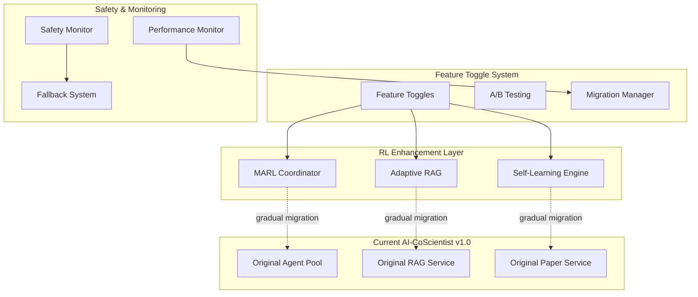

# AI-CoScientist RL Enhancement Implementation Roadmap
## Detailed Migration Strategy & Execution Plan

---

## 🎯 Executive Implementation Summary

This roadmap details the 20-week implementation strategy for integrating Reinforcement Learning into AI-CoScientist, transforming it into a self-learning, adaptive research automation system. The plan emphasizes **zero-downtime migration**, **incremental deployment**, and **risk mitigation** while delivering measurable improvements at each phase.

---

## 🏗️ Implementation Architecture Strategy

### Migration Philosophy: "Parallel Enhancement Pattern"
```yaml
Strategy Overview:
  Approach: Parallel development with gradual migration
  Risk Level: Low (existing system remains functional)
  Downtime: Zero during transition
  Rollback: Full rollback capability at any phase
  Testing: Comprehensive A/B testing throughout

Implementation Pattern:
  Phase 1-2: Build RL infrastructure alongside existing system
  Phase 3-4: Implement RL components with feature flags
  Phase 5: Gradual traffic migration with performance monitoring
  Phase 6: Full migration with fallback safety nets
```

### System Integration Strategy


---

## 📅 Detailed 20-Week Implementation Schedule

### Phase 1: Foundation Infrastructure (Weeks 1-4)

#### Week 1-2: Core RL Infrastructure Setup
```yaml
Week 1 Deliverables:
  Environment Setup:
    - TensorFlow 2.15+ environment setup
    - Ray RLLib integration
    - Distributed training infrastructure
    - GPU cluster configuration

  Database Extensions:
    - RL experience tables design
    - Performance metrics schema
    - Model checkpoint storage
    - Migration scripts preparation

  Development Environment:
    - RL development containers
    - Jupyter notebook environment
    - Experiment tracking (MLflow)
    - Version control for models

Week 2 Deliverables:
  Basic RL Components:
    - Experience replay buffer
    - Basic DQN implementation
    - Reward calculation framework
    - Action space definitions

  Integration Framework:
    - RL service interface
    - Async training pipeline
    - Model serving infrastructure
    - Configuration management
```

#### Week 3-4: Monitoring & Safety Framework
```yaml
Week 3 Deliverables:
  Safety Infrastructure:
    - Action validation framework
    - Reward sanitization system
    - Performance safety monitors
    - Fallback system architecture

  Monitoring System:
    - RL-specific metrics collection
    - Training progress tracking
    - Performance monitoring dashboard
    - Alert system integration

Week 4 Deliverables:
  Testing Framework:
    - RL component unit tests
    - Integration test environment
    - Performance benchmarking tools
    - Safety validation tests

  Documentation:
    - RL architecture documentation
    - API specifications
    - Safety procedures manual
    - Deployment guidelines
```

### Phase 2: Multi-Agent RL Integration (Weeks 5-8)

#### Week 5-6: MARL Coordinator Development
```yaml
Week 5 Deliverables:
  MARL Core Components:
    - Multi-agent DQN implementation
    - Agent performance tracking
    - Task allocation algorithms
    - Collaboration protocols

  Agent Interface Updates:
    - RL-aware agent base class
    - Performance feedback integration
    - Capability scoring system
    - Communication interfaces

Week 6 Deliverables:
  Coordination Algorithms:
    - Task allocation optimization
    - Collaborative learning protocols
    - Performance-based selection
    - Dynamic capability updates

  Testing Environment:
    - Multi-agent simulation
    - Performance comparison tools
    - Collaboration effectiveness metrics
    - Integration test suites
```

#### Week 7-8: MARL Integration & Testing
```yaml
Week 7 Deliverables:
  System Integration:
    - MARL coordinator integration
    - Feature toggle implementation
    - A/B testing framework
    - Performance monitoring

  Agent Pool Enhancement:
    - RL-enhanced agent selection
    - Performance tracking integration
    - Collaboration optimization
    - Fallback mechanisms

Week 8 Deliverables:
  Validation & Testing:
    - Comprehensive testing suite
    - Performance benchmarking
    - Safety validation
    - Documentation updates

  Preparation for Phase 3:
    - RAG system analysis
    - RL strategy identification
    - Implementation planning
    - Resource allocation
```

### Phase 3: Adaptive RAG Implementation (Weeks 9-12)

#### Week 9-10: Adaptive RAG Core Development
```yaml
Week 9 Deliverables:
  RAG Strategy Framework:
    - Dynamic strategy selection
    - Context complexity analysis
    - Source selection optimization
    - Generation strategy adaptation

  RL Models for RAG:
    - Retrieval strategy DQN
    - Source ranking models
    - Generation optimization
    - Quality assessment integration

Week 10 Deliverables:
  RAG Enhancement Implementation:
    - Adaptive retrieval policies
    - Intelligent source selection
    - Dynamic generation strategies
    - Performance feedback loops

  Integration Framework:
    - RAG service enhancements
    - Feature toggle integration
    - Performance monitoring
    - Safety mechanisms
```

#### Week 11-12: RAG Optimization & Validation
```yaml
Week 11 Deliverables:
  Advanced RAG Features:
    - Multi-hop retrieval optimization
    - Context-aware adaptation
    - Real-time strategy learning
    - Quality optimization loops

  Performance Optimization:
    - Latency optimization
    - Resource usage efficiency
    - Scalability enhancements
    - Caching strategies

Week 12 Deliverables:
  Testing & Validation:
    - RAG performance testing
    - Strategy effectiveness evaluation
    - Quality metric validation
    - Integration testing

  Migration Preparation:
    - Deployment scripts
    - Configuration management
    - Rollback procedures
    - Performance baselines
```

### Phase 4: Self-Learning Research Engine (Weeks 13-16)

#### Week 13-14: Research Automation Core
```yaml
Week 13 Deliverables:
  Hypothesis Generation RL:
    - RL-enhanced hypothesis generation
    - Novelty detection integration
    - Feasibility assessment
    - Creativity enhancement

  Experiment Design Optimization:
    - Experiment strategy selection
    - Resource optimization
    - Design quality assessment
    - Validation integration

Week 14 Deliverables:
  Validation Engine:
    - Adaptive validation criteria
    - Evidence integration
    - Uncertainty quantification
    - Results assessment

  Knowledge Graph Integration:
    - Dynamic knowledge updates
    - Pattern learning
    - Relationship detection
    - Knowledge integration
```

#### Week 15-16: Research Loop Completion
```yaml
Week 15 Deliverables:
  Complete Research Cycles:
    - End-to-end research automation
    - Iterative improvement loops
    - Breakthrough detection
    - Quality assurance

  Pattern Learning:
    - Success pattern detection
    - Failure pattern analysis
    - Meta-learning implementation
    - Knowledge transfer

Week 16 Deliverables:
  System Integration:
    - Research engine integration
    - Performance monitoring
    - Safety mechanisms
    - Quality validation

  Testing & Validation:
    - Research cycle testing
    - Pattern learning validation
    - Performance benchmarking
    - Safety verification
```

### Phase 5: Advanced Monitoring & Production Readiness (Weeks 17-20)

#### Week 17-18: Advanced Analytics & Monitoring
```yaml
Week 17 Deliverables:
  Advanced Monitoring:
    - Real-time performance dashboards
    - Learning progress visualization
    - Anomaly detection systems
    - Performance optimization

  Analytics Framework:
    - Comprehensive metrics collection
    - Trend analysis tools
    - Performance insights
    - Optimization recommendations

Week 18 Deliverables:
  Production Monitoring:
    - Scalability monitoring
    - Resource utilization tracking
    - Performance optimization
    - Cost analysis

  Alert Systems:
    - Intelligent alerting
    - Escalation procedures
    - Automated responses
    - Incident management
```

#### Week 19-20: Production Deployment & Optimization
```yaml
Week 19 Deliverables:
  Production Deployment:
    - Gradual traffic migration
    - Performance monitoring
    - Safety validation
    - Rollback procedures

  Optimization:
    - Performance tuning
    - Resource optimization
    - Scalability enhancements
    - Cost optimization

Week 20 Deliverables:
  Final Validation:
    - Complete system testing
    - Performance validation
    - Safety certification
    - Documentation completion

  Launch Preparation:
    - Launch procedures
    - Monitoring setup
    - Support documentation
    - Training materials
```

---

## 🔄 Migration Strategy Details

### Zero-Downtime Migration Process
```python
class MigrationManager:
    """Manages zero-downtime migration to RL-enhanced system"""

    def __init__(self):
        self.feature_toggles = FeatureToggleManager()
        self.traffic_manager = TrafficManager()
        self.performance_monitor = PerformanceMonitor()
        self.rollback_manager = RollbackManager()

    async def execute_gradual_migration(self):
        """Execute gradual migration with safety checks"""

        migration_phases = [
            {'name': 'agent_coordination', 'traffic_percentage': 10},
            {'name': 'rag_optimization', 'traffic_percentage': 10},
            {'name': 'research_automation', 'traffic_percentage': 5},
        ]

        for phase in migration_phases:
            await self._migrate_component_gradually(phase)

    async def _migrate_component_gradually(self, phase):
        """Migrate component with gradual traffic increase"""

        component = phase['name']
        max_traffic = phase['traffic_percentage']

        for traffic_percentage in range(5, max_traffic + 1, 5):
            # Enable feature for percentage of traffic
            await self.feature_toggles.set_traffic_percentage(
                component, traffic_percentage
            )

            # Monitor performance for 24 hours
            await self._monitor_performance(component, traffic_percentage)

            # Check for performance issues
            if await self._performance_issues_detected(component):
                await self.rollback_manager.rollback_component(component)
                raise MigrationException(f"Performance issues in {component}")

            logger.info(f"Successfully migrated {traffic_percentage}% traffic for {component}")

class FeatureToggleManager:
    """Manages feature toggles for gradual RL rollout"""

    def __init__(self):
        self.toggles = {
            'marl_coordinator': False,
            'adaptive_rag': False,
            'self_learning_research': False,
            'advanced_monitoring': False
        }
        self.traffic_percentages = {}

    async def enable_feature(self, feature_name: str, traffic_percentage: float = 100.0):
        """Enable feature for specified traffic percentage"""
        self.toggles[feature_name] = True
        self.traffic_percentages[feature_name] = traffic_percentage

        await self._update_configuration()
        logger.info(f"Enabled {feature_name} for {traffic_percentage}% traffic")

    async def is_feature_enabled(self, feature_name: str, user_context: Dict) -> bool:
        """Check if feature is enabled for specific user/request"""
        if not self.toggles.get(feature_name, False):
            return False

        traffic_percentage = self.traffic_percentages.get(feature_name, 100.0)
        user_hash = self._hash_user_context(user_context)

        return (user_hash % 100) < traffic_percentage
```

### Performance Monitoring During Migration
```python
class MigrationPerformanceMonitor:
    """Monitors system performance during RL migration"""

    def __init__(self):
        self.baseline_metrics = {}
        self.current_metrics = {}
        self.performance_thresholds = {
            'latency_increase': 0.2,  # Max 20% latency increase
            'error_rate_increase': 0.05,  # Max 5% error rate increase
            'quality_decrease': 0.1  # Max 10% quality decrease
        }

    async def establish_baseline(self):
        """Establish performance baseline before migration"""
        self.baseline_metrics = await self._collect_comprehensive_metrics()
        logger.info("Performance baseline established")

    async def monitor_migration_performance(self, component: str) -> bool:
        """Monitor performance during component migration"""

        current_metrics = await self._collect_component_metrics(component)
        performance_comparison = self._compare_performance(
            self.baseline_metrics, current_metrics
        )

        # Check performance degradation
        if self._performance_degraded(performance_comparison):
            logger.warning(f"Performance degradation detected in {component}")
            await self._send_performance_alert(component, performance_comparison)
            return False

        return True

    def _performance_degraded(self, comparison: Dict) -> bool:
        """Check if performance has degraded beyond acceptable thresholds"""

        for metric, threshold in self.performance_thresholds.items():
            if comparison.get(metric, 0) > threshold:
                return True

        return False

class RollbackManager:
    """Manages automatic rollback in case of migration issues"""

    def __init__(self):
        self.rollback_procedures = {}
        self.backup_configurations = {}

    async def prepare_rollback(self, component: str):
        """Prepare rollback procedures for component"""

        # Backup current configuration
        self.backup_configurations[component] = await self._backup_configuration(component)

        # Prepare rollback procedure
        self.rollback_procedures[component] = await self._prepare_rollback_procedure(component)

    async def execute_rollback(self, component: str):
        """Execute automatic rollback for component"""

        logger.critical(f"Executing rollback for {component}")

        # Disable RL features
        await self._disable_rl_features(component)

        # Restore original configuration
        await self._restore_configuration(component)

        # Verify rollback success
        success = await self._verify_rollback(component)

        if success:
            logger.info(f"Rollback successful for {component}")
        else:
            logger.critical(f"Rollback failed for {component} - manual intervention required")
            await self._escalate_to_humans(component)
```

---

## 🧪 Testing & Validation Strategy

### Comprehensive Testing Framework
```yaml
Testing Strategy Overview:
  Unit Testing: 95% code coverage requirement
  Integration Testing: End-to-end workflow validation
  Performance Testing: Load and stress testing
  Safety Testing: Failure mode and recovery testing
  A/B Testing: Live traffic comparison testing

Testing Phases:
  Phase 1: Component-level unit testing
  Phase 2: Integration testing within components
  Phase 3: Cross-component integration testing
  Phase 4: End-to-end system testing
  Phase 5: Production validation testing
```

### A/B Testing Framework
```python
class ABTestingFramework:
    """Comprehensive A/B testing for RL components"""

    def __init__(self):
        self.test_configurations = {}
        self.traffic_splitter = TrafficSplitter()
        self.metrics_collector = MetricsCollector()
        self.statistical_analyzer = StatisticalAnalyzer()

    async def create_ab_test(
        self,
        test_name: str,
        control_component: str,
        treatment_component: str,
        traffic_split: float = 0.5,
        duration_days: int = 7
    ):
        """Create A/B test comparing original vs RL components"""

        test_config = ABTestConfig(
            name=test_name,
            control=control_component,
            treatment=treatment_component,
            traffic_split=traffic_split,
            start_time=datetime.utcnow(),
            end_time=datetime.utcnow() + timedelta(days=duration_days),
            metrics_to_track=[
                'response_time', 'accuracy', 'user_satisfaction',
                'resource_usage', 'error_rate', 'quality_score'
            ]
        )

        self.test_configurations[test_name] = test_config
        await self.traffic_splitter.configure_split(test_config)

        logger.info(f"A/B test {test_name} started with {traffic_split} split")

    async def analyze_test_results(self, test_name: str) -> ABTestResults:
        """Analyze A/B test results for statistical significance"""

        config = self.test_configurations[test_name]

        # Collect metrics from both groups
        control_metrics = await self.metrics_collector.collect(
            config.control, config.start_time, config.end_time
        )
        treatment_metrics = await self.metrics_collector.collect(
            config.treatment, config.start_time, config.end_time
        )

        # Statistical analysis
        results = await self.statistical_analyzer.analyze(
            control_metrics, treatment_metrics
        )

        return ABTestResults(
            test_name=test_name,
            control_performance=control_metrics,
            treatment_performance=treatment_metrics,
            statistical_significance=results.p_value < 0.05,
            confidence_interval=results.confidence_interval,
            effect_size=results.effect_size,
            recommendation=self._generate_recommendation(results)
        )

class PerformanceBenchmarkSuite:
    """Comprehensive performance benchmarking for RL system"""

    def __init__(self):
        self.benchmark_scenarios = self._load_benchmark_scenarios()
        self.performance_targets = self._load_performance_targets()

    async def run_comprehensive_benchmark(self) -> BenchmarkResults:
        """Run complete performance benchmark suite"""

        results = {}

        for scenario_name, scenario in self.benchmark_scenarios.items():
            scenario_results = await self._run_scenario_benchmark(scenario)
            results[scenario_name] = scenario_results

        # Analyze overall performance
        overall_analysis = self._analyze_overall_performance(results)

        return BenchmarkResults(
            scenario_results=results,
            overall_analysis=overall_analysis,
            targets_met=self._check_targets_met(results),
            recommendations=self._generate_recommendations(results)
        )

    async def _run_scenario_benchmark(self, scenario: BenchmarkScenario) -> ScenarioResults:
        """Run individual benchmark scenario"""

        # Load test setup
        await self._setup_test_environment(scenario)

        # Execute benchmark
        start_time = time.time()

        results = []
        for i in range(scenario.num_iterations):
            iteration_result = await self._execute_benchmark_iteration(scenario)
            results.append(iteration_result)

        end_time = time.time()

        # Analyze results
        return ScenarioResults(
            scenario_name=scenario.name,
            iterations=results,
            avg_response_time=np.mean([r.response_time for r in results]),
            avg_accuracy=np.mean([r.accuracy for r in results]),
            avg_quality=np.mean([r.quality for r in results]),
            total_duration=end_time - start_time,
            success_rate=len([r for r in results if r.success]) / len(results)
        )
```

---

## 📊 Risk Management & Mitigation

### Risk Assessment Matrix
```yaml
High-Risk Items:
  RL Model Instability:
    Probability: Medium
    Impact: High
    Mitigation:
      - Comprehensive safety framework
      - Automatic fallback systems
      - Conservative learning rates
      - Regular model validation

  Performance Regression:
    Probability: Medium
    Impact: High
    Mitigation:
      - A/B testing with automatic rollback
      - Performance monitoring thresholds
      - Gradual traffic migration
      - Baseline performance tracking

  Safety Incidents:
    Probability: Low
    Impact: Critical
    Mitigation:
      - Multi-layer safety validation
      - Action space constraints
      - Reward function sanitization
      - Human oversight integration

Medium-Risk Items:
  Integration Complexity:
    Probability: High
    Impact: Medium
    Mitigation:
      - Incremental integration approach
      - Comprehensive testing framework
      - Clear interface definitions
      - Regular integration testing

  Resource Consumption:
    Probability: Medium
    Impact: Medium
    Mitigation:
      - Resource monitoring and limits
      - Efficient model architectures
      - Distributed training setup
      - Cost optimization strategies

  Learning Convergence Issues:
    Probability: Medium
    Impact: Medium
    Mitigation:
      - Multiple learning algorithms
      - Adaptive hyperparameters
      - Transfer learning approaches
      - Expert validation systems

Low-Risk Items:
  Documentation Gaps:
    Probability: Medium
    Impact: Low
    Mitigation:
      - Comprehensive documentation plan
      - Regular documentation reviews
      - Automated documentation generation
      - Knowledge sharing sessions
```

### Contingency Plans
```python
class ContingencyManager:
    """Manages contingency plans for various failure scenarios"""

    def __init__(self):
        self.contingency_plans = {
            'rl_model_failure': self._rl_model_failure_plan,
            'performance_regression': self._performance_regression_plan,
            'safety_incident': self._safety_incident_plan,
            'resource_exhaustion': self._resource_exhaustion_plan,
            'integration_failure': self._integration_failure_plan
        }

    async def execute_contingency(self, incident_type: str, context: Dict):
        """Execute appropriate contingency plan"""

        if incident_type in self.contingency_plans:
            plan = self.contingency_plans[incident_type]
            await plan(context)
        else:
            await self._generic_escalation_plan(incident_type, context)

    async def _rl_model_failure_plan(self, context: Dict):
        """Contingency plan for RL model failures"""

        # Step 1: Immediate fallback to original system
        await self._activate_fallback_systems()

        # Step 2: Isolate failed models
        await self._isolate_failed_models(context['failed_models'])

        # Step 3: Restore from last known good checkpoint
        await self._restore_model_checkpoints()

        # Step 4: Alert development team
        await self._alert_development_team('RL Model Failure', context)

        # Step 5: Schedule model retraining
        await self._schedule_model_retraining()

    async def _performance_regression_plan(self, context: Dict):
        """Contingency plan for performance regressions"""

        # Step 1: Reduce RL traffic gradually
        current_traffic = context['current_rl_traffic']
        for traffic_level in range(current_traffic, 0, -10):
            await self._adjust_rl_traffic(traffic_level)
            await asyncio.sleep(60)  # Wait 1 minute between adjustments

            if await self._performance_recovered():
                break

        # Step 2: If performance not recovered, full fallback
        if not await self._performance_recovered():
            await self._activate_full_fallback()

        # Step 3: Analyze root cause
        await self._initiate_root_cause_analysis(context)

    async def _safety_incident_plan(self, context: Dict):
        """Critical contingency plan for safety incidents"""

        # Step 1: Immediate system shutdown of affected components
        await self._emergency_shutdown(context['affected_components'])

        # Step 2: Activate all safety protocols
        await self._activate_all_safety_protocols()

        # Step 3: Alert all stakeholders immediately
        await self._emergency_alert_all_stakeholders(context)

        # Step 4: Preserve incident data for analysis
        await self._preserve_incident_data(context)

        # Step 5: Initiate formal incident response process
        await self._initiate_formal_incident_response()
```

---

## 📈 Success Validation Framework

### Performance Validation Metrics
```python
class PerformanceValidationFramework:
    """Framework for validating RL system performance improvements"""

    def __init__(self):
        self.baseline_metrics = None
        self.current_metrics = None
        self.validation_criteria = self._load_validation_criteria()

    async def validate_performance_improvements(self) -> ValidationReport:
        """Validate that RL system meets performance improvement targets"""

        # Collect comprehensive metrics
        current_metrics = await self._collect_comprehensive_metrics()

        # Compare against baseline
        improvement_analysis = self._analyze_improvements(current_metrics)

        # Validate against success criteria
        success_validation = self._validate_success_criteria(improvement_analysis)

        # Generate comprehensive report
        return ValidationReport(
            baseline_metrics=self.baseline_metrics,
            current_metrics=current_metrics,
            improvements=improvement_analysis,
            success_criteria_met=success_validation,
            overall_success_rate=self._calculate_overall_success_rate(success_validation),
            recommendations=self._generate_recommendations(improvement_analysis)
        )

    def _analyze_improvements(self, current_metrics: Dict) -> Dict:
        """Analyze performance improvements across all dimensions"""

        improvements = {}

        # Agent coordination improvements
        improvements['agent_coordination'] = {
            'efficiency_gain': (
                current_metrics['agent_coordination']['efficiency'] -
                self.baseline_metrics['agent_coordination']['efficiency']
            ) / self.baseline_metrics['agent_coordination']['efficiency'],
            'collaboration_improvement': (
                current_metrics['agent_coordination']['collaboration_score'] -
                self.baseline_metrics['agent_coordination']['collaboration_score']
            ) / self.baseline_metrics['agent_coordination']['collaboration_score'],
            'success_rate_improvement': (
                current_metrics['agent_coordination']['success_rate'] -
                self.baseline_metrics['agent_coordination']['success_rate']
            ) / self.baseline_metrics['agent_coordination']['success_rate']
        }

        # RAG optimization improvements
        improvements['rag_optimization'] = {
            'retrieval_accuracy_gain': (
                current_metrics['rag']['retrieval_accuracy'] -
                self.baseline_metrics['rag']['retrieval_accuracy']
            ) / self.baseline_metrics['rag']['retrieval_accuracy'],
            'generation_quality_improvement': (
                current_metrics['rag']['generation_quality'] -
                self.baseline_metrics['rag']['generation_quality']
            ) / self.baseline_metrics['rag']['generation_quality'],
            'response_relevance_improvement': (
                current_metrics['rag']['response_relevance'] -
                self.baseline_metrics['rag']['response_relevance']
            ) / self.baseline_metrics['rag']['response_relevance']
        }

        # Research automation improvements
        improvements['research_automation'] = {
            'hypothesis_success_improvement': (
                current_metrics['research']['hypothesis_success_rate'] -
                self.baseline_metrics['research']['hypothesis_success_rate']
            ) / self.baseline_metrics['research']['hypothesis_success_rate'],
            'discovery_rate_improvement': (
                current_metrics['research']['discovery_rate'] -
                self.baseline_metrics['research']['discovery_rate']
            ) / self.baseline_metrics['research']['discovery_rate'],
            'efficiency_improvement': (
                current_metrics['research']['cycle_efficiency'] -
                self.baseline_metrics['research']['cycle_efficiency']
            ) / self.baseline_metrics['research']['cycle_efficiency']
        }

        return improvements

    def _validate_success_criteria(self, improvements: Dict) -> Dict:
        """Validate improvements against predefined success criteria"""

        success_criteria = self.validation_criteria['success_thresholds']
        validation_results = {}

        for component, component_improvements in improvements.items():
            validation_results[component] = {}

            for metric, improvement in component_improvements.items():
                threshold = success_criteria.get(component, {}).get(metric, 0.0)
                validation_results[component][metric] = improvement >= threshold

        return validation_results
```

---

## 🎓 Training & Knowledge Transfer

### Team Training Program
```yaml
Training Program Overview:
  Duration: 8 weeks (parallel with implementation)
  Participants: 15-20 team members
  Format: Hands-on workshops + theoretical sessions
  Certification: RL system operation certification

Training Modules:
  Module 1: RL Fundamentals (Week 1-2)
    - Reinforcement learning theory
    - Multi-agent systems
    - DQN and policy gradient methods
    - Safety considerations in RL

  Module 2: AI-CoScientist RL Architecture (Week 3-4)
    - System architecture overview
    - Component interactions
    - Safety frameworks
    - Monitoring and debugging

  Module 3: Operational Procedures (Week 5-6)
    - Deployment procedures
    - Monitoring and alerting
    - Troubleshooting guidelines
    - Emergency procedures

  Module 4: Advanced Topics (Week 7-8)
    - Performance optimization
    - Research applications
    - Future enhancements
    - Best practices
```

### Documentation & Knowledge Base
```yaml
Documentation Strategy:
  Technical Documentation:
    - Architecture diagrams and specifications
    - API documentation
    - Configuration guides
    - Troubleshooting guides

  Operational Documentation:
    - Deployment procedures
    - Monitoring runbooks
    - Emergency response procedures
    - Performance tuning guides

  Training Materials:
    - Interactive tutorials
    - Video demonstrations
    - Hands-on labs
    - Certification materials

  Maintenance Documentation:
    - Regular maintenance procedures
    - Update and upgrade guides
    - Backup and recovery procedures
    - Security guidelines
```

---

<function_calls>
<invoke name="TodoWrite">
<parameter name="todos">[{"content": "Analyze current AI-CoScientist architecture for upgrade baseline", "status": "completed", "activeForm": "Analyzing current system architecture"}, {"content": "Design RL-enhanced Multi-Agent Coordinator architecture", "status": "completed", "activeForm": "Designing RL Multi-Agent Coordinator"}, {"content": "Design Adaptive RAG Service with RL optimization", "status": "completed", "activeForm": "Designing Adaptive RAG with RL"}, {"content": "Design continuous learning infrastructure and feedback loops", "status": "completed", "activeForm": "Designing continuous learning infrastructure"}, {"content": "Design performance monitoring and metrics system", "status": "completed", "activeForm": "Designing performance monitoring system"}, {"content": "Create implementation roadmap and migration strategy", "status": "completed", "activeForm": "Creating implementation roadmap"}, {"content": "Generate comprehensive technical specifications", "status": "completed", "activeForm": "Generating technical specifications"}]