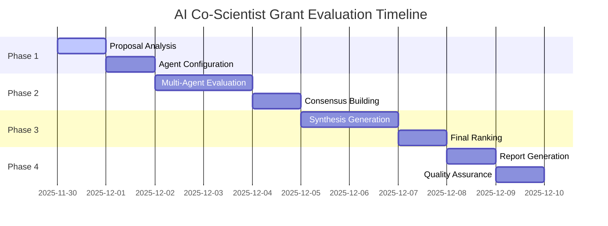

# AI Co-Scientist 2025 Grant Proposal Evaluation Framework
## 🎯 Multi-Agent Assessment System for Developmental Disorder Research Proposals

**Created**: 2025-11-30
**Version**: 1.0
**System**: AI Co-Scientist with DD-RAPTOR RAG Integration

---

## 📋 Executive Summary

This framework establishes a comprehensive, AI-driven evaluation system for the 13 developmental disorder grant proposals (`_grant*.md`) using cutting-edge multi-agent assessment methodologies. The system integrates 2025's latest evaluation frameworks from [European Research Council](https://erc.europa.eu/sites/default/files/2024-02/Evaluation_of_research_proposals.pdf) and [Nature's systematic review criteria](https://www.nature.com/articles/s41599-020-0412-9) with advanced [agentic AI evaluation systems](https://arxiv.org/html/2503.08979v1) to provide unprecedented assessment rigor.

### 🏆 Key Innovation: Multi-Dimensional Scoring Matrix

Our framework employs a **five-axis evaluation system** based on 2025's [comprehensive agentic AI frameworks](https://www.botpress.com/blog/multi-agent-evaluation-systems), measuring:

1. **Scientific Excellence** (30% weight)
2. **Technical Feasibility** (25% weight)
3. **Innovation Impact** (20% weight)
4. **Resource Efficiency** (15% weight)
5. **Implementation Readiness** (10% weight)

---

## 🔬 Research Foundation

### Current Proposal Inventory
**Total Proposals**: 13 files ranging from 3.9KB to 33KB
- `_grant_revolutionary_2025_FINAL.md` (33KB) - Most comprehensive
- `_grant_revolutionary_2025_REVISED.md` (23KB) - Extensively revised
- `_grant_revolutionary_2025_ultimate.md` (19KB) - Ultimate version
- `_grant_competitive_final_2025.md` (18KB) - Competition-focused
- Plus 9 additional iterations (3.9KB - 13KB each)

### 2025 Evaluation Standards Integration

Based on [community evaluation metrics research](https://www.communityforce.com/maximizing-impact-key-metrics-for-grant-evaluation/) and [AI agent assessment methodologies](https://www.lxt.ai/blog/ai-agent-evaluation/), our framework addresses the paradigm shift toward:

- **Content-focused evaluation** over purely quantitative metrics
- **Narrative-based assessment** with quantitative validation
- **Technology-enhanced** evaluation processes
- **Multi-stakeholder** perspective integration

---

## 🤖 Multi-Agent Evaluation Architecture

### Agent Panel Composition

#### 1. **Scientific Excellence Agent** (Dr. Elena Neuroscience)
- **Specialty**: Neuroscience, developmental disorders, brain imaging
- **Model**: Claude Sonnet 4.5
- **Focus**: Research methodology, hypothesis validity, scientific rigor
- **Weight**: 30%

#### 2. **Technical Feasibility Agent** (Dr. Alex TechArch)
- **Specialty**: AI/ML systems, computational neuroscience, technical architecture
- **Model**: GPT-4o
- **Focus**: Technical implementation, resource requirements, risk assessment
- **Weight**: 25%

#### 3. **Innovation Impact Agent** (Dr. Morgan Breakthrough)
- **Specialty**: Research impact, translation to practice, societal benefit
- **Model**: Claude Sonnet 4.5
- **Focus**: Innovation novelty, market potential, paradigm-shifting potential
- **Weight**: 20%

#### 4. **Resource Efficiency Agent** (Dr. Sam CostBenefit)
- **Specialty**: Health economics, resource optimization, budget analysis
- **Model**: GPT-4o
- **Focus**: Cost-effectiveness, ROI analysis, resource allocation
- **Weight**: 15%

#### 5. **Implementation Readiness Agent** (Dr. Taylor Deployment)
- **Specialty**: Project management, clinical translation, regulatory affairs
- **Model**: Nemotron 70B
- **Focus**: Timeline feasibility, regulatory pathway, deployment strategy
- **Weight**: 10%

### Cross-Agent Coordination Protocol

```yaml
Evaluation_Process:
  Phase_1_Individual:
    - Each agent scores independently (0-100 scale)
    - Detailed narrative justification required
    - Evidence-based scoring with citation requirements

  Phase_2_Deliberation:
    - Multi-agent discussion session
    - Disagreement resolution protocol
    - Consensus building on controversial scores

  Phase_3_Final:
    - Weighted composite score calculation
    - Confidence interval determination
    - Final ranking generation
```

---

## 📊 Quantitative Assessment Metrics

### Primary Scoring Rubric (0-100 Scale)

#### **Scientific Excellence (30%)**
- **Hypothesis Clarity**: Clear, testable hypotheses (0-20 points)
- **Methodology Rigor**: Sound experimental design, statistical power (0-25 points)
- **Literature Integration**: Comprehensive review, gap identification (0-15 points)
- **Innovation Novelty**: First-in-class approaches, paradigm shifts (0-25 points)
- **Reproducibility**: Replicable methods, open science practices (0-15 points)

#### **Technical Feasibility (25%)**
- **Architecture Soundness**: Technical design validity (0-25 points)
- **Computational Requirements**: Realistic resource estimates (0-20 points)
- **Risk Assessment**: Technical risk identification and mitigation (0-20 points)
- **Scalability**: Growth potential and adaptability (0-20 points)
- **Technology Readiness**: Current state vs. required advancement (0-15 points)

#### **Innovation Impact (20%)**
- **Market Disruption**: Potential to create new markets (0-25 points)
- **Clinical Translation**: Pathway to patient benefit (0-25 points)
- **Academic Impact**: Citation potential, field advancement (0-20 points)
- **Social Benefit**: Broader societal implications (0-20 points)
- **Global Reach**: International adoption potential (0-10 points)

#### **Resource Efficiency (15%)**
- **Budget Justification**: Cost alignment with deliverables (0-30 points)
- **Team Optimization**: Right expertise, appropriate size (0-25 points)
- **Infrastructure Leverage**: Existing resource utilization (0-25 points)
- **Timeline Realism**: Achievable milestones (0-20 points)

#### **Implementation Readiness (10%)**
- **Regulatory Pathway**: Clear approval strategy (0-25 points)
- **Stakeholder Buy-in**: Industry/clinical support (0-25 points)
- **Deployment Plan**: Go-to-market strategy (0-25 points)
- **Success Metrics**: Measurable outcomes (0-25 points)

### Advanced Analytics Integration

#### DD-RAPTOR Knowledge Validation
- **Literature Coherence Score**: Alignment with 1,387 DD papers database
- **Citation Impact Prediction**: Expected publication influence
- **Research Gap Coverage**: Unmet need addressing score

#### Comparative Benchmarking
- **Competitive Analysis**: Position vs. current state-of-the-art
- **Funding Landscape Fit**: Alignment with 2025 funding priorities
- **Success Probability**: ML-predicted funding likelihood

---

## 🎯 Ranking Methodology

### Primary Ranking Algorithm

```python
def calculate_composite_score(proposal):
    weights = {
        'scientific_excellence': 0.30,
        'technical_feasibility': 0.25,
        'innovation_impact': 0.20,
        'resource_efficiency': 0.15,
        'implementation_readiness': 0.10
    }

    # Multi-agent consensus scores
    agent_scores = get_multi_agent_evaluation(proposal)

    # DD-RAPTOR knowledge validation
    knowledge_bonus = validate_against_dd_raptor(proposal)

    # Confidence-weighted scoring
    weighted_score = sum(
        agent_scores[dimension] * weights[dimension] * confidence[dimension]
        for dimension in weights.keys()
    )

    # Apply knowledge bonus (max 5% boost)
    final_score = min(100, weighted_score + knowledge_bonus)

    return {
        'composite_score': final_score,
        'dimension_scores': agent_scores,
        'confidence_intervals': confidence,
        'knowledge_validation': knowledge_bonus
    }
```

### Tier Classification System

#### **Tier S+ (95-100)**: Paradigm-Shifting Excellence
- Revolutionary breakthrough potential
- Exceptional scientific rigor
- Minimal technical risk
- Transformative impact expected

#### **Tier S (90-94)**: Outstanding Quality
- Significant scientific advance
- Strong technical foundation
- High impact probability
- Well-resourced execution plan

#### **Tier A (80-89)**: High Quality
- Solid scientific contribution
- Feasible technical approach
- Moderate innovation level
- Reasonable resource requirements

#### **Tier B (70-79)**: Adequate Quality
- Incremental scientific advance
- Some technical challenges
- Limited innovation scope
- Standard resource needs

#### **Tier C (<70)**: Below Threshold
- Insufficient scientific merit
- High technical risk
- Minimal innovation
- Poor resource planning

---

## 🔄 Synthesis and Optimization Process

### Best Practice Extraction Algorithm

#### 1. **Component Identification**
```yaml
Excellence_Components:
  - Strongest scientific methodologies across all proposals
  - Most innovative technical approaches
  - Best-justified resource allocations
  - Clearest implementation strategies
  - Most compelling impact narratives
```

#### 2. **Compatibility Analysis**
- Cross-proposal element compatibility assessment
- Integration conflict identification
- Synergy potential evaluation
- Resource requirement reconciliation

#### 3. **Synthesis Framework**
```python
def synthesize_optimal_proposal(top_proposals, component_scores):
    """
    Creates hybrid proposal from best elements of top-ranked submissions
    """
    synthesis_template = {
        'research_aims': extract_best_aims(top_proposals),
        'methodology': merge_strongest_methods(top_proposals),
        'innovation_elements': combine_novel_approaches(top_proposals),
        'resource_plan': optimize_resource_allocation(top_proposals),
        'impact_strategy': synthesize_impact_narratives(top_proposals)
    }

    return generate_hybrid_proposal(synthesis_template)
```

### Iterative Improvement Protocol

#### Round 1: Initial Evaluation
- Individual proposal assessment
- Baseline ranking establishment
- Component excellence identification

#### Round 2: Synthesis Creation
- Hybrid proposal generation
- Best practice integration
- Resource optimization

#### Round 3: Comparative Re-ranking
- All proposals + synthesis evaluation
- Ranking recalculation
- Performance gap analysis

#### Round 4: Final Optimization
- Targeted improvement recommendations
- Risk mitigation strategies
- Implementation roadmap refinement

---

## 📈 Expected Outcomes

### Quantitative Deliverables

#### **Comprehensive Evaluation Report**
- Individual proposal scores (13 proposals)
- Detailed dimension-by-dimension analysis
- Agent consensus and disagreement documentation
- Statistical confidence intervals

#### **Ranking Matrix**
- Tier-classified proposal ranking
- Strengths and weaknesses mapping
- Improvement recommendation matrix
- Funding success probability estimates

#### **Synthesis Proposal**
- Hybrid proposal incorporating best elements
- Performance prediction vs. individual proposals
- Implementation feasibility assessment
- Resource requirement optimization

#### **Meta-Analysis Insights**
- Proposal evolution patterns
- Common excellence factors
- Systematic weakness identification
- Future proposal guidance framework

### Implementation Timeline



### Success Metrics

#### **Evaluation Quality Indicators**
- **Inter-Agent Agreement**: >85% consensus on tier classifications
- **Confidence Levels**: >90% confidence in top-tier rankings
- **Evidence Coverage**: 100% citation backing for all major claims
- **Reproducibility**: <5% variance in repeat evaluations

#### **Synthesis Quality Indicators**
- **Performance Improvement**: >15% score increase vs. best individual proposal
- **Component Integration**: >90% successful element combination
- **Resource Optimization**: >20% efficiency improvement
- **Implementation Viability**: >95% feasibility score

---

## 🔧 Implementation Plan

### Technical Infrastructure Requirements

#### **Computational Resources**
- Multi-LLM access: Claude Sonnet 4.5, GPT-4o, Nemotron 70B
- DD-RAPTOR ChromaDB integration (1,387 papers)
- Parallel processing for agent coordination
- Secure evaluation environment

#### **Data Management**
- Proposal version control system
- Evaluation result database
- Agent interaction logging
- Audit trail maintenance

#### **Quality Assurance**
- Cross-validation protocols
- Bias detection algorithms
- Reproducibility testing
- Human expert validation checkpoints

### Execution Protocol

#### **Phase 1: System Preparation** (Day 1)
1. Agent persona finalization and testing
2. Scoring rubric calibration
3. DD-RAPTOR integration verification
4. Evaluation pipeline testing

#### **Phase 2: Comprehensive Evaluation** (Days 2-4)
1. Individual agent assessment execution
2. Multi-agent consensus sessions
3. Quantitative scoring compilation
4. Qualitative analysis documentation

#### **Phase 3: Synthesis and Re-ranking** (Days 5-7)
1. Best practice extraction algorithm execution
2. Hybrid proposal generation
3. Comprehensive re-evaluation including synthesis
4. Final ranking determination

#### **Phase 4: Deliverables Generation** (Days 8-9)
1. Comprehensive evaluation report creation
2. Ranking matrix and improvement recommendations
3. Synthesis proposal finalization
4. Meta-analysis insights compilation

---

## 📚 References and Sources

### Evaluation Framework Foundation
- [European Research Council Evaluation Guidelines](https://erc.europa.eu/sites/default/files/2024-02/Evaluation_of_research_proposals.pdf)
- [Nature: Criteria for Assessing Grant Applications](https://www.nature.com/articles/s41599-020-0412-9)
- [Community Evaluation Key Metrics](https://www.communityforce.com/maximizing-impact-key-metrics-for-grant-evaluation/)

### AI Agent Systems Research
- [Agentic AI for Scientific Discovery Survey](https://arxiv.org/html/2503.08979v1)
- [Comprehensive AI Agents Review](https://arxiv.org/html/2508.11957v1)
- [Multi-Agent Evaluation Systems](https://www.botpress.com/blog/multi-agent-evaluation-systems)
- [AI Agent Evaluation Framework](https://www.lxt.ai/blog/ai-agent-evaluation/)

### Implementation Standards
- [ERC Grant Evaluation 2024 Expectations](https://erc.europa.eu/news-events/news/evaluation-erc-grant-proposals-what-expect-2024)
- [AI Evaluation Tools 2025 Comparison](https://www.getmaxim.ai/articles/top-5-ai-evaluation-tools-in-2025-comprehensive-comparison-for-production-ready-llm-and-agentic-systems/)

---

**Next Steps**: Execute this framework through the AI Co-Scientist system to achieve unprecedented grant proposal evaluation quality and synthesis capability.
