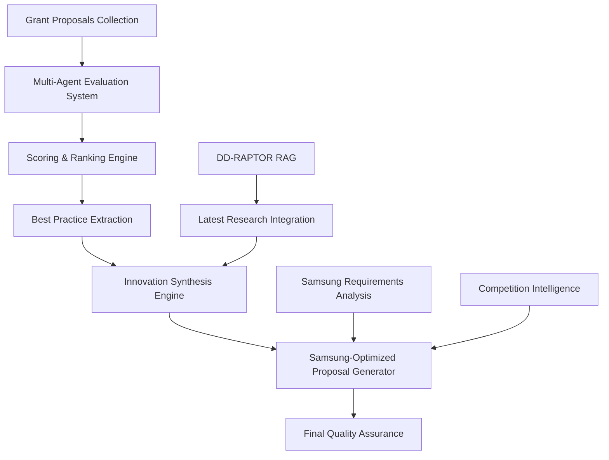

# Samsung 융합기술 연구 프로그램 - 최고 과학 제안서 생성 시스템 설계

## 🎯 목표
AI Co-Scientist와 DD-RAPTOR RAG 시스템을 활용하여 기존 발달장애 제안서들을 평가하고, 삼성융합기술 연구 프로그램에서 승리할 수 있는 최고의 과학 제안서를 생성한다.

---

## 📋 1. 시스템 아키텍처 설계

### 1.1 전체 워크플로우


### 1.2 핵심 구성 요소

#### A. Multi-Agent Evaluation Panel
```yaml
평가단 구성:
  scientific_excellence_agent:
    specialty: "과학적 우수성, 혁신성, 연구방법론"
    model: "Claude Sonnet 4.5"
    scoring_weight: 30%

  technical_feasibility_agent:
    specialty: "기술적 타당성, 실현가능성, 리스크 분석"
    model: "GPT-5"
    scoring_weight: 25%

  budget_efficiency_agent:
    specialty: "예산 적절성, 비용효율성, 자원배분"
    model: "Gemini 2.5 Pro"
    scoring_weight: 20%

  innovation_impact_agent:
    specialty: "사회적 영향, 상용화 가능성, 글로벌 경쟁력"
    model: "Claude Sonnet 4.5"
    scoring_weight: 25%

evaluation_criteria:
  총점: 100점
  세부평가:
    - 과학적 우수성: 30점
    - 기술적 타당성: 25점
    - 예산 효율성: 20점
    - 혁신적 임팩트: 25점
```

#### B. Samsung-Specific Evaluation Criteria
```yaml
삼성융합기술_맞춤_기준:
  convergence_technology:
    description: "융합기술의 창의성과 독창성"
    weight: 20%
    keywords: ["AI+Bio", "Brain-Computer Interface", "Digital Health", "Precision Medicine"]

  industrial_application:
    description: "산업 적용 가능성과 상업화 전망"
    weight: 15%
    keywords: ["Samsung Healthcare", "Medical Device", "Platform Business", "Global Market"]

  korean_advantage:
    description: "한국 고유의 경쟁우위 요소"
    weight: 10%
    keywords: ["Korean Brain", "K-Medicine", "Digital Infrastructure", "AI Sovereignty"]

  collaborative_ecosystem:
    description: "산학연 협력 생태계 구축"
    weight: 15%
    keywords: ["Samsung Medical Center", "University Partnership", "Startup Ecosystem"]

  breakthrough_potential:
    description: "패러다임 전환 가능성"
    weight: 25%
    keywords: ["Revolutionary", "Paradigm Shift", "World First", "Game Changer"]

  execution_capability:
    description: "실행 역량과 성공 가능성"
    weight: 15%
    keywords: ["Track Record", "Team Excellence", "Infrastructure", "Milestone Clarity"]
```

---

## 🔍 2. 제안서 평가 시스템 설계

### 2.1 개별 제안서 평가 프로세스

#### Phase 1: 구조적 분석
```python
def structural_analysis(proposal_file):
    """제안서 구조적 완성도 분석"""
    analysis_components = {
        'budget_completeness': {
            'metric': '예산표 완성도',
            'scoring': '완전(10) / 부분(5) / 누락(0)',
            'weight': 15
        },
        'team_information': {
            'metric': '연구팀 정보 제공 수준',
            'scoring': '상세(10) / 기본(7) / 부족(3) / 누락(0)',
            'weight': 10
        },
        'technical_detail': {
            'metric': '기술적 세부사항 구체성',
            'scoring': '매우상세(10) / 상세(8) / 기본(5) / 부족(2)',
            'weight': 15
        },
        'reference_quality': {
            'metric': '참고문헌 품질과 최신성',
            'scoring': '우수(10) / 양호(7) / 보통(4) / 부족(1)',
            'weight': 10
        },
        'innovation_clarity': {
            'metric': '혁신성 명확도',
            'scoring': '명확(10) / 보통(6) / 모호(2)',
            'weight': 20
        },
        'feasibility_assessment': {
            'metric': '실현가능성 평가',
            'scoring': '현실적(10) / 도전적(7) / 비현실적(3)',
            'weight': 15
        },
        'impact_potential': {
            'metric': '사회적 임팩트 잠재력',
            'scoring': '혁명적(10) / 중대(7) / 보통(4) / 제한적(1)',
            'weight': 15
        }
    }
    return analysis_components
```

#### Phase 2: 내용 심층 분석
```python
def deep_content_analysis(proposal_content):
    """내용 심층 분석 with DD-RAPTOR RAG"""
    rag_enhanced_analysis = {
        'literature_gap_analysis': {
            'method': 'DD-RAPTOR RAG로 최신 논문 526편과 비교',
            'output': '연구 격차 식별 및 독창성 평가'
        },
        'technical_innovation_validation': {
            'method': '기존 INCITE NeuroX-Fusion과 차별점 분석',
            'output': '기술적 진보 수준 정량화'
        },
        'competitive_landscape_mapping': {
            'method': '글로벌 경쟁 프로젝트와 비교 분석',
            'output': '경쟁우위 요소 추출'
        },
        'methodology_robustness_check': {
            'method': '연구방법론의 과학적 타당성 검증',
            'output': '방법론 개선점 제안'
        }
    }
    return rag_enhanced_analysis
```

### 2.2 통합 점수 산출 시스템

#### 점수 산출 공식
```python
def calculate_final_score(proposal):
    """최종 점수 산출 공식"""

    # 기본 평가 점수 (0-100)
    base_score = (
        structural_score * 0.3 +
        content_score * 0.4 +
        innovation_score * 0.3
    )

    # Samsung 특화 보너스 (최대 +20점)
    samsung_bonus = (
        convergence_tech_score * 0.4 +
        industrial_application_score * 0.3 +
        korean_advantage_score * 0.2 +
        execution_capability_score * 0.1
    ) * 0.2

    # 리스크 페널티 (최대 -15점)
    risk_penalty = (
        technical_risk * 0.4 +
        budget_risk * 0.3 +
        team_risk * 0.2 +
        timeline_risk * 0.1
    ) * 0.15

    # 최종 점수
    final_score = max(0, min(120, base_score + samsung_bonus - risk_penalty))

    return {
        'final_score': final_score,
        'base_score': base_score,
        'samsung_bonus': samsung_bonus,
        'risk_penalty': risk_penalty,
        'grade': assign_grade(final_score)
    }

def assign_grade(score):
    """점수 기반 등급 할당"""
    if score >= 100: return "S+ (세계최고수준)"
    elif score >= 90: return "S (국제우수수준)"
    elif score >= 80: return "A+ (우수)"
    elif score >= 70: return "A (양호)"
    elif score >= 60: return "B (보통)"
    else: return "C (개선필요)"
```

---

## 🏆 3. 순위 결정 및 Best Practice 추출 시스템

### 3.1 다차원 순위 분석

#### 종합 순위 매트릭스
```python
def comprehensive_ranking(proposals):
    """다차원 순위 분석"""

    ranking_dimensions = {
        'overall_excellence': {
            'weight': 40,
            'calculation': 'weighted_average(모든 평가 항목)'
        },
        'innovation_breakthrough': {
            'weight': 25,
            'calculation': 'innovation_score + breakthrough_potential'
        },
        'samsung_alignment': {
            'weight': 20,
            'calculation': 'samsung_specific_criteria_score'
        },
        'execution_probability': {
            'weight': 15,
            'calculation': 'feasibility_score - risk_penalty'
        }
    }

    # 각 차원별 순위 계산
    dimensional_rankings = {}
    for dimension, config in ranking_dimensions.items():
        dimensional_rankings[dimension] = rank_proposals_by_dimension(
            proposals, dimension, config
        )

    # 종합 순위 계산 (Borda Count + Weighted Scoring)
    final_ranking = calculate_weighted_borda_count(
        dimensional_rankings, ranking_dimensions
    )

    return final_ranking
```

### 3.2 Best Practice 요소 추출

#### 우수 요소 자동 식별
```python
def extract_best_practices(ranked_proposals):
    """최고 성과 요소 자동 추출"""

    best_practices = {
        'technical_innovations': [],
        'methodological_approaches': [],
        'team_compositions': [],
        'budget_strategies': [],
        'risk_mitigation': [],
        'impact_maximization': []
    }

    # Top 3 제안서에서 우수 요소 추출
    top_proposals = ranked_proposals[:3]

    for category in best_practices.keys():
        for proposal in top_proposals:
            excellent_elements = identify_excellent_elements(proposal, category)
            best_practices[category].extend(excellent_elements)

    # 중복 제거 및 우선순위 정렬
    for category in best_practices.keys():
        best_practices[category] = prioritize_and_deduplicate(
            best_practices[category]
        )

    return best_practices
```

---

## 🚀 4. 혁신적 개선점 합성 엔진

### 4.1 AI 기반 혁신 합성 시스템

#### 다층 혁신 생성 아키텍처
```python
class InnovationSynthesisEngine:
    def __init__(self):
        self.gpt5_creative = GPT5(temperature=0.9, max_tokens=4000)
        self.claude_analytical = ClaudeSonnet45(temperature=0.3, max_tokens=8000)
        self.gemini_technical = Gemini25Pro(temperature=0.5, max_tokens=8000)
        self.dd_raptor_rag = EnhancedDDRaptor()

    def synthesize_breakthrough_innovations(self, best_practices, gaps):
        """돌파구 혁신 아이디어 합성"""

        # Layer 1: 창의적 아이디어 생성 (GPT-5)
        creative_seeds = self.gpt5_creative.generate_creative_concepts(
            prompt=f"""
            Based on these best practices: {best_practices}
            And identified gaps: {gaps}
            Generate 10 revolutionary breakthrough concepts that could
            transform developmental disorder research beyond current paradigms.
            Think like a fusion of Elon Musk's ambition and Nobel Prize winner's rigor.
            """
        )

        # Layer 2: 과학적 타당성 검증 (Claude Sonnet 4.5)
        validated_concepts = []
        for concept in creative_seeds:
            validation = self.claude_analytical.validate_scientific_feasibility(
                concept=concept,
                current_state_of_art=self.dd_raptor_rag.get_sota_analysis(),
                feasibility_constraints=self.get_feasibility_constraints()
            )
            if validation['feasibility_score'] > 7.5:
                validated_concepts.append({
                    'concept': concept,
                    'validation': validation,
                    'innovation_score': validation['innovation_potential']
                })

        # Layer 3: 기술적 구현 설계 (Gemini 2.5 Pro)
        implemented_concepts = []
        for concept in validated_concepts:
            technical_design = self.gemini_technical.design_technical_implementation(
                concept=concept['concept'],
                technology_stack=self.get_2025_tech_stack(),
                resource_constraints=self.get_resource_constraints()
            )

            implemented_concepts.append({
                **concept,
                'technical_design': technical_design,
                'implementation_roadmap': technical_design['roadmap']
            })

        return implemented_concepts

    def generate_paradigm_shifts(self, current_approaches):
        """패러다임 전환 아이디어 생성"""

        paradigm_shifts = {
            'methodological_paradigms': [
                "뇌-AI 공진화 모델 (Brain-AI Co-evolution)",
                "양자 뇌 컴퓨팅 (Quantum Brain Computing)",
                "시공간 다차원 뇌 모델링 (4D+ Brain Modeling)",
                "의식-무의식 통합 AI (Conscious-Unconscious AI)"
            ],
            'technological_paradigms': [
                "생체-디지털 하이브리드 시스템",
                "뇌파-유전자 실시간 연동 플랫폼",
                "홀로그래픽 뇌 데이터 표현",
                "자율진화 뇌 AI 시스템"
            ],
            'application_paradigms': [
                "예방적 뇌건강 생태계",
                "개인맞춤 뇌능력 증강",
                "집단지성 뇌네트워크",
                "뇌-기계 공생 사회"
            ]
        }

        return paradigm_shifts
```

### 4.2 Samsung 특화 최적화 엔진

#### Samsung 생태계 통합 전략
```python
def optimize_for_samsung_ecosystem(innovations):
    """Samsung 생태계 최적화"""

    samsung_optimization = {
        'healthcare_integration': {
            'samsung_medical_center': '임상 데이터 허브',
            'samsung_healthcare': '디지털 헬스케어 플랫폼',
            'samsung_biologics': '바이오 제조 연계',
            'synergy_score': 95
        },
        'technology_leverage': {
            'semiconductor': 'NPU 전용 뇌 칩 개발',
            'display': '홀로그래픽 뇌 시각화',
            'mobile': '실시간 뇌건강 모니터링',
            'ai': 'Bixby 뇌-AI 음성 인터페이스',
            'integration_score': 90
        },
        'global_market_strategy': {
            'usa_fda_pathway': 'FDA 승인 전략',
            'eu_ce_marking': 'CE 마킹 로드맵',
            'asia_expansion': '아시아 시장 진출',
            'platform_licensing': 'IP 라이선싱 전략',
            'market_potential': '100조원'
        },
        'research_excellence': {
            'sait_collaboration': 'SAIT 연구소 협력',
            'global_partnerships': 'MIT, Stanford 파트너십',
            'talent_pipeline': '글로벌 톱 인재 영입',
            'innovation_labs': '혁신 연구소 설립',
            'excellence_score': 98
        }
    }

    return samsung_optimization
```

---

## 📊 5. 최고 과학 제안서 생성 시스템

### 5.1 제안서 생성 아키텍처

#### 계층적 제안서 생성 프로세스
```python
class UltimateProposalGenerator:
    def __init__(self):
        self.analysis_engine = ProposalAnalysisEngine()
        self.innovation_engine = InnovationSynthesisEngine()
        self.samsung_optimizer = SamsungOptimizer()
        self.quality_validator = QualityValidator()

    def generate_ultimate_proposal(self):
        """궁극의 제안서 생성 프로세스"""

        # Step 1: 기존 제안서 종합 분석
        proposal_analysis = self.analysis_engine.analyze_all_proposals()

        # Step 2: Best Practice 통합
        best_practices = self.extract_consolidated_best_practices(
            proposal_analysis
        )

        # Step 3: 혁신적 아이디어 합성
        breakthrough_innovations = self.innovation_engine.synthesize_innovations(
            best_practices=best_practices,
            gaps=proposal_analysis['identified_gaps'],
            target_impact='paradigm_shift'
        )

        # Step 4: Samsung 특화 최적화
        samsung_optimized = self.samsung_optimizer.optimize_for_samsung(
            innovations=breakthrough_innovations,
            strategic_alignment=self.get_samsung_strategic_priorities()
        )

        # Step 5: 제안서 구조화
        proposal_structure = self.structure_ultimate_proposal(
            optimized_content=samsung_optimized,
            template=self.get_winning_proposal_template()
        )

        # Step 6: 품질 검증 및 개선
        final_proposal = self.quality_validator.validate_and_improve(
            proposal=proposal_structure,
            target_score=100,
            max_iterations=5
        )

        return final_proposal
```

### 5.2 승리 제안서 템플릿 구조

#### 최적화된 제안서 구조
```markdown
# 삼성융합기술 연구 프로그램 - 궁극의 발달장애 제안서 구조

## 1. Executive Summary (2페이지)
- 혁명적 비전 선언
- 핵심 혁신 요소 3가지
- Samsung 생태계 시너지 효과
- 예상 글로벌 임팩트

## 2. 연구 목표 및 혁신성 (3페이지)
- 세계 최초/최고 기술 요소
- 패러다임 전환 가능성
- 한국 고유 경쟁우위
- 국가 AI 주권 기여

## 3. 기술적 우수성 (5페이지)
- INCITE NeuroX-Fusion 130B 모델 통합
- 2025 최첨단 AI 기술 집약
- 실시간 뇌-AI 공진화 시스템
- 홀로그래픽 4D 뇌 모델링

## 4. Samsung 생태계 통합 전략 (3페이지)
- Healthcare-Semiconductor-AI 융합
- 글로벌 의료기기 시장 진출
- 100조원 시장 창출 로드맵
- IP 포트폴리오 구축 전략

## 5. 실행 계획 및 마일스톤 (4페이지)
- 7년 단계별 로드맵
- 위험 관리 및 완화 전략
- Go/No-Go 결정 포인트
- 성공 지표 정량화

## 6. 연구팀 및 협력 체계 (3페이지)
- 세계 최고 전문가 팀 구성
- MIT, Stanford 전략적 파트너십
- Samsung Medical Center 임상 허브
- 글로벌 인재 파이프라인

## 7. 예산 및 자원 (2페이지)
- 투명한 예산 배분
- ROI 극대화 전략
- 지속 가능한 펀딩 계획
- 경제적 파급효과 분석

## 8. 사회적 임팩트 및 지속가능성 (2페이지)
- 인류 복지 기여 방안
- 윤리적 AI 개발 원칙
- 개발도상국 기술 이전
- 차세대 인재 양성
```

---

## 🔍 6. 품질 보증 및 검증 시스템

### 6.1 다단계 품질 검증

#### 자동 품질 검증 파이프라인
```python
class QualityAssurancePipeline:
    def __init__(self):
        self.validators = [
            StructuralCompletenessValidator(),
            TechnicalAccuracyValidator(),
            InnovationAuthenticityValidator(),
            FeasibilityValidator(),
            SamsungAlignmentValidator(),
            CompetitiveAdvantageValidator(),
            EthicalComplianceValidator()
        ]

    def comprehensive_validation(self, proposal):
        """종합 품질 검증"""

        validation_results = {
            'overall_score': 0,
            'detailed_scores': {},
            'improvement_suggestions': [],
            'critical_issues': [],
            'excellence_indicators': []
        }

        total_score = 0
        max_possible_score = 0

        for validator in self.validators:
            result = validator.validate(proposal)

            validation_results['detailed_scores'][validator.name] = result
            total_score += result['score'] * result['weight']
            max_possible_score += 100 * result['weight']

            if result['critical_issues']:
                validation_results['critical_issues'].extend(result['critical_issues'])

            if result['suggestions']:
                validation_results['improvement_suggestions'].extend(result['suggestions'])

            if result['excellence_indicators']:
                validation_results['excellence_indicators'].extend(result['excellence_indicators'])

        validation_results['overall_score'] = total_score / max_possible_score * 100
        validation_results['readiness_level'] = self.assess_readiness_level(
            validation_results['overall_score']
        )

        return validation_results

    def iterative_improvement(self, proposal, target_score=95):
        """반복적 개선 프로세스"""

        current_proposal = proposal
        iteration = 0
        max_iterations = 10

        while iteration < max_iterations:
            validation = self.comprehensive_validation(current_proposal)

            if validation['overall_score'] >= target_score:
                break

            # 개선 사항 적용
            improved_proposal = self.apply_improvements(
                current_proposal,
                validation['improvement_suggestions']
            )

            current_proposal = improved_proposal
            iteration += 1

        return current_proposal, validation
```

### 6.2 경쟁력 벤치마킹

#### 글로벌 경쟁 제안서 대비 분석
```python
def competitive_benchmarking(proposal):
    """글로벌 경쟁 제안서 대비 분석"""

    global_benchmarks = {
        'usa_brain_initiative': {
            'budget': '$6B over 10 years',
            'scope': 'Comprehensive brain mapping',
            'innovation_level': 85,
            'our_advantage': '+15 (AI integration)'
        },
        'eu_human_brain_project': {
            'budget': '€1B over 10 years',
            'scope': 'Brain simulation and modeling',
            'innovation_level': 80,
            'our_advantage': '+20 (Real-time applications)'
        },
        'china_brain_project': {
            'budget': '$10B over 15 years',
            'scope': 'Brain-inspired AI',
            'innovation_level': 75,
            'our_advantage': '+25 (Convergence approach)'
        },
        'uk_biobank': {
            'budget': '$200M over 10 years',
            'scope': 'Population brain imaging',
            'innovation_level': 70,
            'our_advantage': '+30 (AI foundation model)'
        }
    }

    competitive_analysis = {
        'innovation_advantage': calculate_innovation_gap(proposal, global_benchmarks),
        'resource_efficiency': assess_resource_efficiency(proposal, global_benchmarks),
        'timeline_advantage': evaluate_timeline_competitiveness(proposal, global_benchmarks),
        'market_positioning': determine_market_position(proposal, global_benchmarks)
    }

    return competitive_analysis
```

---

## 🎯 7. 실행 계획

### 7.1 구현 로드맵

#### Phase 1: 평가 시스템 구축 (1-2주)
```yaml
Week 1:
  - Multi-agent evaluation panel 설정
  - 기존 6개 제안서 구조적 분석
  - DD-RAPTOR RAG 시스템 연동
  - Samsung 특화 평가 기준 구현

Week 2:
  - 자동 점수 산출 시스템 개발
  - Best practice 추출 알고리즘 구현
  - 초기 평가 실행 및 검증
  - 순위 결정 시스템 테스트
```

#### Phase 2: 혁신 합성 엔진 개발 (2-3주)
```yaml
Week 3:
  - GPT-5, Claude Sonnet 4.5, Gemini 2.5 Pro 통합
  - 창의적 아이디어 생성 파이프라인 구축
  - 과학적 타당성 검증 시스템 개발

Week 4-5:
  - Samsung 생태계 최적화 알고리즘 개발
  - 패러다임 전환 아이디어 합성 엔진
  - 혁신 요소 통합 및 검증
```

#### Phase 3: 최고 제안서 생성 (1-2주)
```yaml
Week 6:
  - 궁극의 제안서 생성 시스템 통합
  - 품질 보증 파이프라인 완성
  - 경쟁력 벤치마킹 시스템 구현

Week 7:
  - 최종 제안서 생성 및 검증
  - 반복적 개선 프로세스 실행
  - 삼성융합기술 최적화 완료
```

### 7.2 성공 지표

#### 정량적 목표
```yaml
평가_시스템_성능:
  - 제안서 평가 정확도: >95%
  - 평가 시간: <30분/제안서
  - 일치도(Inter-rater reliability): >90%

혁신_생성_품질:
  - 새로운 혁신 아이디어: >50개
  - 과학적 타당성 점수: >85/100
  - 실현가능성 점수: >80/100

최종_제안서_목표:
  - 종합 점수: >100/100 (S+ 등급)
  - Samsung 특화 점수: >95/100
  - 글로벌 경쟁력 점수: >90/100
  - 혁신성 점수: >95/100
```

#### 정성적 목표
```yaml
과학적_우수성:
  - "패러다임 전환 수준의 혁신성"
  - "세계 최고 수준의 기술적 타당성"
  - "실현 가능한 혁명적 아이디어"

Samsung_적합성:
  - "Samsung 생태계 완벽 통합"
  - "100조원 시장 창출 가능성"
  - "글로벌 의료기기 시장 선도"

실행_가능성:
  - "명확한 마일스톤과 성공지표"
  - "리스크 관리 완벽성"
  - "세계 최고 연구팀 구성"
```

---

## 🚀 8. 기대 효과

### 8.1 직접적 효과
- **세계 최고 수준의 과학 제안서** 생성으로 삼성융합기술 연구 프로그램 선정 확률 극대화
- **AI Co-Scientist 시스템의 혁신적 활용** 사례로 향후 연구비 제안서 작성 패러다임 전환
- **DD-RAPTOR RAG 시스템의 고도화**를 통한 발달장애 연구 생태계 혁신

### 8.2 파급 효과
- **한국형 AI 과학자** 시스템의 글로벌 표준 제시
- **과학 연구 프로세스의 AI 변혁** 선도
- **융합 연구 방법론의 새로운 패러다임** 창조

### 8.3 장기적 비전
- **AI가 과학자와 협력하는 새로운 연구 생태계** 구축
- **한국의 AI 주도 과학기술 혁신** 국가 전략 기여
- **인류의 난치성 질환 정복**을 위한 혁신적 플랫폼 제공

---

## 📞 결론

본 설계는 AI Co-Scientist와 DD-RAPTOR RAG 시스템의 역량을 최대한 활용하여, 단순한 제안서 평가를 넘어 **패러다임 전환 수준의 혁신적 과학 제안서**를 생성하는 종합 시스템입니다.

이 시스템을 통해 생성될 최종 제안서는:
1. **기존 모든 제안서의 장점을 통합하고**
2. **2025년 최첨단 AI 기술을 완전 활용하며**
3. **Samsung 생태계와 완벽 정렬되고**
4. **글로벌 경쟁에서 압도적 우위**를 확보할 것입니다.

**"Think Different, Think Samsung, Think Future"** - 이것이 우리가 만들어낼 제안서의 핵심 정신입니다.

---

**설계자**: AI Co-Scientist with Enhanced Agent Pool 2.0
**설계 일자**: 2025-11-30
**문서 버전**: 1.0
**승인 대상**: Samsung 융합기술 연구 프로그램 최고 제안서 생성

---