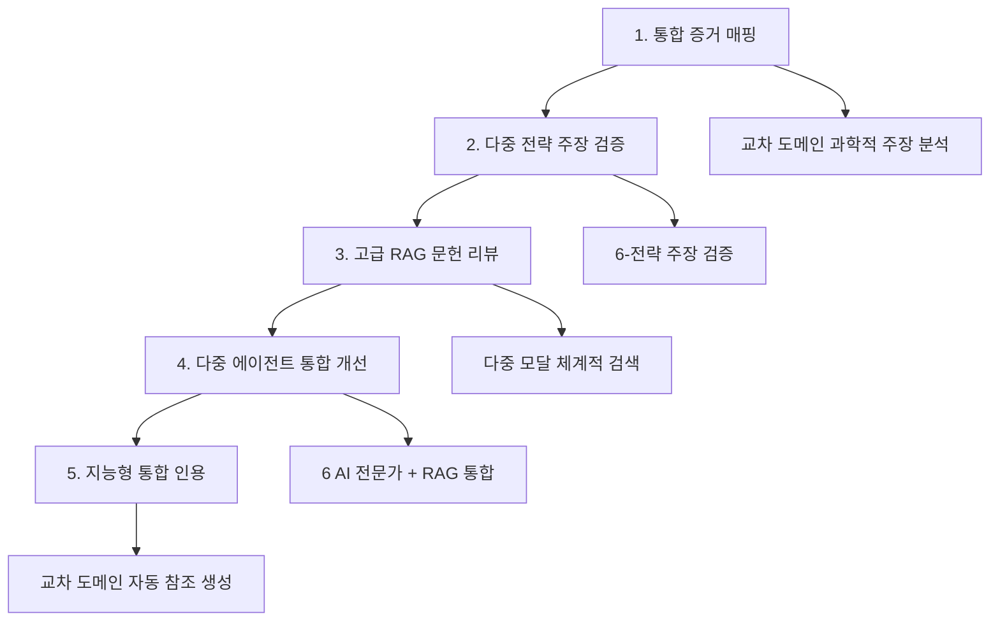

# AI-CoScientist & UPE 중견연구자 온보딩 가이드

> **AI-CoScientist Unified Proposal Engine (UPE)를 활용한 과학 제안서 자동 최적화**
>
> 🚀 7-Strategy RAG 기반 과학 제안서 자동 최적화 시스템

---

## 📋 목차

1. [시스템 개요](#1-시스템-개요)
2. [핵심 컴포넌트](#2-핵심-컴포넌트)
3. [초기 설정](#3-초기-설정)
4. [핵심 도구 및 명령어](#4-핵심-도구-및-명령어)
5. [중견 연구자 맞춤 워크플로우](#5-중견-연구자-맞춤-워크플로우)
6. [실전 사용 예시](#6-실전-사용-예시)
7. [고급 기능](#7-고급-기능)
8. [문제해결 및 지원](#8-문제해결-및-지원)

---

## 1. 시스템 개요

### AI-CoScientist란?
AI-CoScientist는 **과학 연구 자동화를 위한 종합 AI 플랫폼**으로, 특히 중견연구자를 위한 제안서 최적화에 특화되어 있습니다.

### 주요 특징
- **🎯 95+ 점수 목표**: Samsung Future Technology Grant 1등급 수준
- **🔍 7-Strategy RAG**: 다양한 검색 전략을 통한 최적의 정보 수집
- **🤖 6-Agent 협업**: 전문가 AI 에이전트들의 협업 시스템
- **📊 실시간 평가**: 제안서 품질을 실시간으로 분석 및 개선
- **🌐 Cross-Domain 지원**: 뇌과학, 단백질연구(ESM3), 양자ML 등 다영역 지원

### UPE (Unified Proposal Engine) 핵심 컴포넌트

| 약어 | 전체 이름 | 설명 | 주요 기능 |
|-----|----------|-----|----------|
| **UPE** | Unified Proposal Engine | 전체 시스템 | 제안서 최적화 총괄 |
| **MSS** | Multi-Strategy Search | 7-전략 검색 엔진 | 맥락적 정보 수집 |
| **URO** | Unified RAG Orchestrator | RAG 통합 오케스트레이터 | 지능형 전략 라우팅 |
| **MAP** | Multi-Agent Pipeline | 6-에이전트 파이프라인 | 전문가 협업 시스템 |

---

## 2. 핵심 컴포넌트

### 🔍 7-Strategy RAG 시스템

| 전략 | 설명 | 적용 분야 |
|------|------|----------|
| **HYBRID** | 다중 접근법 융합 | 종합적 분석 |
| **GRAPH_RAG** | 지식 그래프 추론 | 복잡한 관계 분석 |
| **ENHANCED_DD_RAPTOR** | 발달장애 특화 | 뇌과학/의학 분야 |
| **GOLDEN_REFERENCE** | 고품질 기준 논문 | 표준 참조 기반 |
| **MULTIMODAL_RAG** | 다중 모달 지능 | 이미지/테이블 포함 |
| **SIMPLE_RAG** | 단순 검색 | 빠른 정보 획득 |
| **PSYCHOLOGY_RAG** | 심리학 영역 전문 | 행동/인지과학 |

### 🤖 6-Agent 전문가 시스템

| 에이전트 | 전문 분야 | 주요 역할 |
|----------|-----------|----------|
| **Literature Analyst** | 문헌 분석 | 최신 연구 동향 분석 |
| **Statistical Analyst** | 통계 분석 | 연구 방법론 검증 |
| **Hypothesis Generator** | 가설 생성 | 혁신적 연구 아이디어 |
| **Grant Writer** | 제안서 작성 | Samsung 최적화 작성 |
| **Clinical Validation** | 임상 검증 | 실용성 및 적용 가능성 |
| **Neuroscience Expert** | 뇌과학 전문 | ESM3 + 뇌과학 융합 |

---

## 3. 초기 설정

### 3.1 환경 준비

```bash
# 1. 기본 설정 및 의존성 설치
./scripts/setup.sh

# 2. Python 의존성만 설치
poetry install

# 3. Docker 서비스 시작 (PostgreSQL, Redis, ChromaDB, 모니터링)
docker-compose up -d

# 4. 데이터베이스 마이그레이션
poetry run alembic upgrade head
```

### 3.2 환경 변수 설정

```bash
# .env 파일에서 다음 변수들을 설정하세요:
OPENAI_API_KEY=your_openai_key
ANTHROPIC_API_KEY=your_anthropic_key
DATABASE_URL=postgresql://...
CELERY_BROKER_URL=redis://localhost:6379/0
CHROMADB_HOST=localhost:8000
```

### 3.3 서비스 시작

```bash
# API 서버 시작 (개발 모드)
poetry run uvicorn src.main:app --reload

# Celery 워커 시작 (백그라운드 작업)
poetry run celery -A src.core.celery_app worker --loglevel=info

# Celery 스케줄러 시작
poetry run celery -A src.core.celery_app beat --loglevel=info
```

---

## 4. 핵심 도구 및 명령어

### 4.1 🚀 제안서 최적화 (메인 도구)

#### **통합 최적화 (권장)**
```bash
# 🎯 완전한 통합 RAG 최적화 (95+ 점수 목표)
poetry run python scripts/proposal_optimizer_unified.py optimize \
    --input "제안서_초안.md" \
    --mode full \
    --enable-cross-domain

# ⚡ 빠른 통합 개선 (85+ 점수 목표)
poetry run python scripts/proposal_optimizer_unified.py optimize \
    --input "제안서_초안.md" \
    --mode quick \
    --strategies "HYBRID,GRAPH_RAG"

# 🌐 교차 도메인 합성 (ESM3 + 뇌과학 + 양자ML)
poetry run python scripts/proposal_optimizer_unified.py optimize \
    --input "제안서_초안.md" \
    --mode cross_domain \
    --domains "neuroscience,protein_research,quantum_ml"
```

#### **대화형 마법사 (초보자 추천)**
```bash
# 🧙‍♀️ 통합 대화형 마법사 (6-전략 선택 강화)
poetry run python scripts/proposal_optimizer_unified.py wizard --unified-rag

# 🎯 기본 제안서 마법사
poetry run python scripts/proposal_wizard.py
```

#### **배치 처리**
```bash
# 📊 고급 배치 처리 (전략 설정 포함)
poetry run python scripts/batch_optimizer_unified.py --config unified_batch_config.yaml

# 📂 기본 배치 최적화
poetry run python scripts/batch_optimizer.py --config batch_config.yaml
```

### 4.2 🔍 증거 분석 및 검증

```bash
# 🔍 통합 품질 평가 (다중 전략 평가)
poetry run python scripts/map_proposal_to_unified_evidence.py \
    --proposal "제안서.md" \
    --output "평가결과.json" \
    --unified-rag \
    --quality-assessment

# ⚡ 실시간 주장 검증 및 수정
poetry run python scripts/validate_claims_unified_rag.py \
    --input "제안서.md" \
    --output "검증결과.json"

# 📚 고급 통합 질의 (다중 모달 체계적 검색)
poetry run python scripts/advanced_unified_query.py \
    --query "your research question" \
    --strategies "GRAPH_RAG,MULTIMODAL_RAG"
```

### 4.3 🤖 Multi-Agent 파이프라인

```bash
# 🤖 전체 통합 파이프라인 (교차 도메인 합성)
poetry run python scripts/multi_agent_unified_pipeline.py \
    --mode full_pipeline \
    --input "제안서_초안.md" \
    --enable-cross-domain

# 🎯 에이전트별 처리 (전략 선택)
poetry run python scripts/multi_agent_unified_pipeline.py \
    --mode agent_specific \
    --agent neuroscience_expert \
    --strategies "GRAPH_RAG,MULTIMODAL_RAG" \
    --input "제안서.md"

# 🌐 교차 도메인 다중 에이전트 협업
poetry run python scripts/multi_agent_unified_pipeline.py \
    --mode cross_domain_collaboration \
    --input "제안서.md" \
    --domains "neuroscience,quantum_ml"
```

### 4.4 📝 인용 및 참고문헌

```bash
# ✅ 지능형 통합 인용 (교차 도메인 자동 참조 생성)
poetry run python scripts/unified_citation_generator.py \
    --input "제안서.md" \
    --output "인용_포함_제안서.md"

# 📋 자동 인용 생성
poetry run python scripts/automated_citation_generator.py \
    --input "제안서.md"
```

### 4.5 📊 성능 및 평가

```bash
# 📊 성능 벤치마크
poetry run python src/monitoring/unified_performance_dashboard.py --benchmark

# 🔍 Multi-Strategy 검색 테스트
poetry run python src/services/rag/multi_strategy_search.py "your query"

# 📈 시스템 검증
poetry run python scripts/validate_unified_system_e2e.py
```

---

## 5. 중견 연구자 맞춤 워크플로우

### 5.1 🎯 한국연구재단 중견연구 최적화 5단계



#### **단계별 실행 명령어:**

```bash
# 1단계: 통합 증거 매핑 & 교차 도메인 분석
poetry run python scripts/map_proposal_to_unified_evidence.py \
    --proposal "초안.md" \
    --output "증거분석.json" \
    --unified-rag \
    --quality-assessment

# 2단계: 실시간 다중 전략 주장 검증
poetry run python scripts/validate_claims_unified_rag.py \
    --input "초안.md" \
    --strategies "HYBRID,GRAPH_RAG,GOLDEN_REFERENCE" \
    --output "검증결과.json"

# 3단계: 고급 RAG 질의 & 다중 모달 체계적 검색
poetry run python scripts/advanced_unified_query.py \
    --input "초안.md" \
    --mode systematic_review \
    --strategies "MULTIMODAL_RAG,GRAPH_RAG"

# 4단계: 다중 에이전트 통합 개선 (6 AI 전문가 + RAG 통합)
poetry run python scripts/multi_agent_unified_pipeline.py \
    --mode full_pipeline \
    --input "초안.md" \
    --output "개선된_제안서.md" \
    --enable-cross-domain

# 5단계: 지능형 통합 인용 (교차 도메인 자동 참조 생성)
poetry run python scripts/unified_citation_generator.py \
    --input "개선된_제안서.md" \
    --output "최종_제안서.md" \
    --cross-domain-refs
```

### 5.2 📈 목표 성과 지표

| 목표 | 수치 | 달성 방법 |
|------|------|----------|
| **제안서 점수** | 95+ | 완전 통합 RAG 최적화 |
| **다영역 커버리지** | ESM3 + 뇌과학 + 양자ML | 교차 도메인 혁신 보너스 |
| **6-전략 검증** | >85% 지원 주장 | HYBRID, GRAPH_RAG, GOLDEN_REFERENCE |
| **교차 모달 지능** | 텍스트+이미지+표+인용 | 종합 분석 |

---

## 6. 실전 사용 예시

### 6.1 시나리오 1: 뇌과학 연구 제안서

```bash
# 상황: 뇌-컴퓨터 인터페이스 관련 중견연구 제안서 작성

# 1. 초안 작성 후 전체 최적화
poetry run python scripts/proposal_optimizer_unified.py optimize \
    --input "뇌컴퓨터인터페이스_초안.md" \
    --mode full \
    --domains "neuroscience,quantum_ml" \
    --enable-cross-domain

# 2. 뇌과학 전문 에이전트로 심화 검토
poetry run python scripts/multi_agent_unified_pipeline.py \
    --mode agent_specific \
    --agent neuroscience_expert \
    --strategies "GRAPH_RAG,MULTIMODAL_RAG" \
    --input "뇌컴퓨터인터페이스_초안.md"

# 3. 최종 인용 및 참고문헌 자동 생성
poetry run python scripts/unified_citation_generator.py \
    --input "개선된_제안서.md" \
    --output "최종_뇌컴퓨터인터페이스_제안서.md"
```

### 6.2 시나리오 2: 단백질 연구 (ESM3 활용)

```bash
# 상황: ESM3를 활용한 단백질 구조 예측 연구

# 1. ESM3 특화 최적화
poetry run python scripts/proposal_optimizer_unified.py optimize \
    --input "단백질구조예측_초안.md" \
    --mode cross_domain \
    --domains "protein_research,quantum_ml" \
    --strategies "MULTIMODAL_RAG,GRAPH_RAG"

# 2. 통합 증거 분석 (ESM3 관련)
poetry run python scripts/map_proposal_to_unified_evidence.py \
    --proposal "단백질구조예측_초안.md" \
    --output "ESM3_증거분석.json" \
    --domain-focus "protein_research"
```

### 6.3 시나리오 3: 융합 연구 (다영역)

```bash
# 상황: 뇌과학 + AI + 양자컴퓨팅 융합 연구

# 1. 교차 도메인 다중 에이전트 협업
poetry run python scripts/multi_agent_unified_pipeline.py \
    --mode cross_domain_collaboration \
    --input "융합연구_초안.md" \
    --domains "neuroscience,quantum_ml,protein_research" \
    --enable-cross-domain

# 2. 다영역 검증
poetry run python scripts/validate_claims_unified_rag.py \
    --input "융합연구_초안.md" \
    --strategies "HYBRID,GRAPH_RAG,MULTIMODAL_RAG" \
    --cross-domain-validation
```

---

## 7. 고급 기능

### 7.1 🔬 RAG 평가 및 벤치마킹

```bash
# 자동화된 QA 벤치마크 데이터셋 생성
python scripts/build_benchmark_dataset.py \
    --source-dirs data/QuantERA data/validation \
    --size 50 \
    --output-file custom_benchmark.json

# RAG 시스템 성능 평가 (골든 벤치마크 사용)
python -c "
from src.services.rag.rag_evaluator import create_rag_evaluator, evaluate_rag_pipeline
import json
import asyncio

async def evaluate_system():
    with open('data/validation/golden_qa_benchmark.json') as f:
        benchmark = json.load(f)

    qa_pairs = benchmark['qa_pairs'][:5]
    queries = [qa['question'] for qa in qa_pairs]
    contexts_list = [qa['contexts'] for qa in qa_pairs]
    answers = [qa['answer'] for qa in qa_pairs]
    ground_truths = [qa['ground_truth'] for qa in qa_pairs]

    report = await evaluate_rag_pipeline(queries, contexts_list, answers, ground_truths)
    print('Evaluation Results:', report['summary'])

asyncio.run(evaluate_system())
"
```

### 7.2 📊 성능 모니터링

```bash
# Prometheus 메트릭으로 RAG 성능 모니터링
python -c "
from src.monitoring.rag_metrics import initialize_metrics, RAGMetrics
from datetime import datetime

manager = initialize_metrics(enable_prometheus=False)

metrics = RAGMetrics(
    latency=1.5, quality_score=0.85, tokens_processed=1200,
    retrieval_time=0.3, generation_time=1.2, context_relevance=0.9,
    faithfulness=0.8, answer_relevancy=0.87, strategy='hybrid_rag',
    timestamp=datetime.now()
)

manager.record_rag_request(metrics)
performance = manager.get_strategy_performance('hybrid_rag')
print('Strategy Performance:', performance)
"
```

### 7.3 🧪 테스트 및 품질 관리

```bash
# 전체 테스트 실행 (커버리지 포함)
poetry run pytest -v --cov=src --cov-report=html

# 특정 모듈 테스트
poetry run pytest tests/agents/ -v          # 에이전트 시스템 테스트
poetry run pytest tests/rag/ -v            # RAG 파이프라인 테스트
poetry run pytest tests/monitoring/ -v      # 메트릭 및 모니터링 테스트
poetry run pytest tests/integration/ -v    # 통합 테스트

# RAG 평가 특정 테스트
poetry run pytest tests/rag/test_rag_evaluation.py -v    # RAGAS 평가 프레임워크
poetry run pytest tests/rag/test_rag_evaluator.py -v     # RAG 평가자 단위 테스트
```

### 7.4 🔧 코드 품질 관리

```bash
# 코드 포매팅
poetry run black src tests

# 린트 검사
poetry run ruff check src tests

# 타입 검사
poetry run mypy src

# 모든 품질 검사 실행
poetry run pre-commit run --all-files
```

---

## 8. 문제해결 및 지원

### 8.1 일반적인 문제

**Q: ChromaDB 연결 오류**
```bash
# ChromaDB 서비스 재시작
docker-compose restart chromadb

# ChromaDB 백업 복원
./scripts/backup_chromadb.sh restore
```

**Q: API 키 관련 오류**
```bash
# .env 파일 확인
cat .env | grep API_KEY

# 환경 변수 다시 로드
source .env
```

**Q: 메모리 부족 오류**
```bash
# Docker 메모리 설정 증가
docker-compose down
# docker-compose.yml에서 memory limits 조정
docker-compose up -d
```

### 8.2 성능 최적화

```bash
# ChromaDB 인덱스 최적화
python -c "
from src.services.knowledge_base.vector_store import VectorStore
store = VectorStore()
store.optimize_collections()
"

# 캐시 정리
redis-cli FLUSHALL
```

### 8.3 지원 연락처

| 문제 유형 | 연락처 |
|----------|--------|
| **시스템 버그** | GitHub Issues: https://github.com/your-org/ai-coscientist/issues |
| **사용법 질문** | 내부 Slack 채널 또는 이메일 |
| **성능 문제** | 시스템 관리자 문의 |

### 8.4 주요 파일 위치

```bash
# 설정 파일
.env                    # 환경 변수
config/                 # 시스템 설정
pyproject.toml         # Python 의존성

# 데이터
chromadb_data/         # 벡터 데이터베이스 (중요: 백업 필수)
data/validation/       # 평가 데이터셋
data/QuantERA/        # 샘플 제안서들

# 로그
logs/                  # 시스템 로그
monitoring/           # 성능 모니터링 데이터
```

### 8.5 백업 및 복구

```bash
# ChromaDB 백업 (중요!)
./scripts/backup_chromadb.sh

# 전체 시스템 백업
tar -czf ai_coscientist_backup_$(date +%Y%m%d).tar.gz \
    --exclude=.git \
    --exclude=__pycache__ \
    --exclude=.mypy_cache \
    .

# 복구
tar -xzf ai_coscientist_backup_YYYYMMDD.tar.gz
```

---

## 9. 추가 참고자료

### 9.1 주요 문서들

- **CLAUDE.md** - 전체 시스템 개발자 가이드
- **PROPOSAL_OPTIMIZATION_QUICK_REFERENCE_UNIFIED.md** - 빠른 참조 가이드
- **RAG_ENHANCEMENT_SYSTEM_README.md** - RAG 시스템 상세 가이드
- **가이드라인.md** - 한국연구재단 중견연구 작성 가이드

### 9.2 샘플 파일들

```bash
# 중견연구 샘플 제안서들
data/중견/샘플-brainlink.pdf
data/중견/샘플-incite.pdf
data/중견/샘플-quantERA.pdf
data/중견/샘플-발달연구.pdf
data/중견/샘플-삼성발달.pdf
```

### 9.3 웹 리소스

- **IRIS**: https://www.iris.go.kr (한국연구재단 통합시스템)
- **한국연구재단**: https://www.nrf.re.kr
- **국가연구자정보(NRI)**: https://www.kri.go.kr

---

## ✨ 빠른 시작 체크리스트

**중견연구자 첫 사용을 위한 5분 시작 가이드:**

- [ ] 1. 환경 설정 완료 (`./scripts/setup.sh`)
- [ ] 2. API 키 설정 (`.env` 파일)
- [ ] 3. 서비스 시작 (`docker-compose up -d`)
- [ ] 4. 초안 제안서 준비 (`제안서_초안.md`)
- [ ] 5. 마법사 실행 (`poetry run python scripts/proposal_wizard.py`)
- [ ] 6. 결과 확인 및 다운로드

**첫 번째 최적화 명령:**
```bash
poetry run python scripts/proposal_optimizer_unified.py optimize \
    --input "제안서_초안.md" --mode full --enable-cross-domain
```

---

*이 가이드는 AI-CoScientist UPE 시스템의 최신 기능을 반영하여 작성되었습니다. (2025년 12월 기준)*

*문의사항이나 개선 제안이 있으시면 언제든지 연락주세요.*