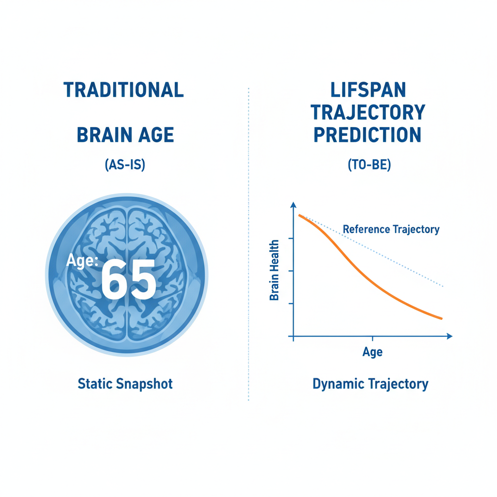
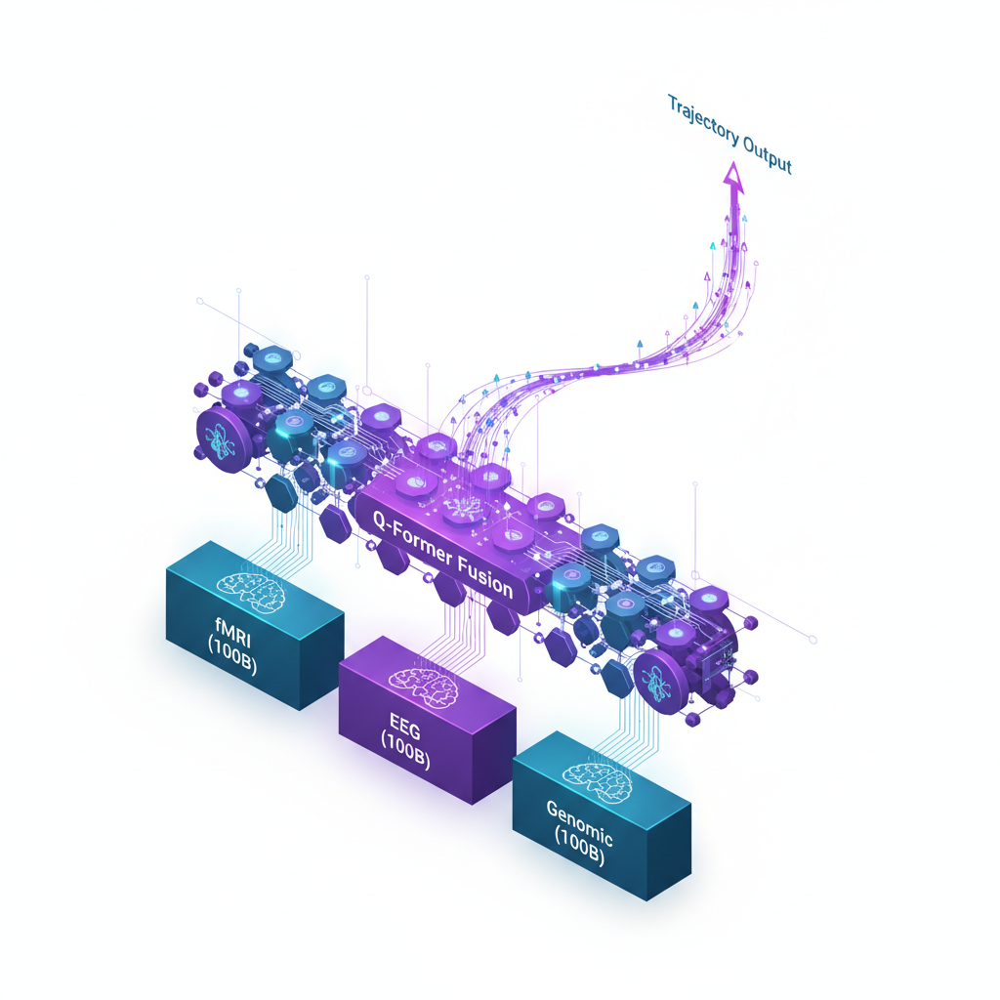
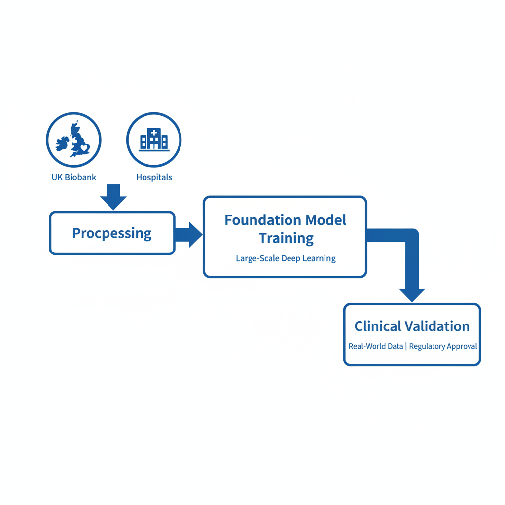
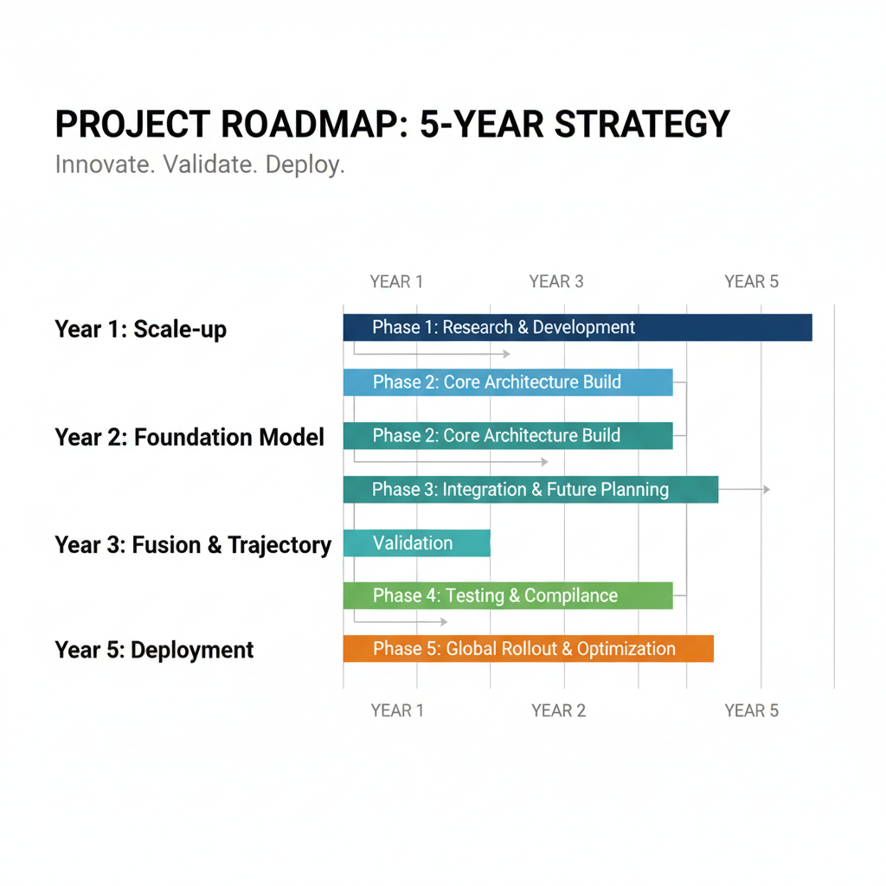

# 발달-노화 궤적 예측 멀티모달 파운데이션 모델: MRI-EEG-유전체 통합 기반 전생애주기 신경발달 및 신경퇴행 예측 시스템

**연구책임자**: [연구책임자명]
**연구기간**: 2026.03 ~ 2031.02 (5년)
**연구비**: 7.5억원 (연 1.5억원)
**연구유형**: 핵심연구(유형C)

---

# 1. 연구과제의 필요성

## 1.1 연구 배경: 분절된 뇌 연구의 한계와 생애주기 연속성의 재발견

인간의 뇌는 출생 직후의 급격한 발달부터 노년기의 완만한 퇴행에 이르기까지 끊임없이 변화하는 역동적인 기관이다. 이러한 변화의 궤적은 개인마다 고유하며, 그 미세한 차이가 자폐 스펙트럼 장애(ASD)와 같은 발달 장애나 알츠하이머 치매(AD)와 같은 신경퇴행성 질환의 발병을 결정짓는 핵심 요인이 된다.

그러나 지금까지의 뇌과학 연구는 '발달(Development)'과 '노화(Aging)'를 별개의 영역으로 분리하여 다루어 왔다. 소아청소년과에서는 발달 장애만을, 신경과에서는 노인성 질환만을 연구하며, 두 시기를 관통하는 연결 고리를 놓치고 있다. 최근 *Nature Neuroscience* (2024) 등에서 제기된 **"신경퇴행의 기원은 신경발달에 있다(Neurodevelopmental Origins of Neurodegeneration)"**는 가설은 이러한 이분법적 접근의 한계를 지적한다. 발달기에 형성된 뇌 회로의 미세한 결함이 수십 년간의 잠복기를 거쳐 노년기에 치매로 발현될 수 있다는 것이다. 따라서 뇌 질환의 근본적인 메커니즘을 규명하고 조기 개입의 골든타임을 확보하기 위해서는, 발달과 노화를 아우르는 **전생애주기(Lifespan) 관점의 통합적 연구**가 필수적이다.

## 1.2 사회적 문제: 증가하는 발달장애와 치매, 그리고 조기 진단의 실패

### (1) 발달장애의 급증과 조기 진단의 난제
국내 등록 발달장애인 수는 매년 7천~8천 명씩 지속적으로 증가하고 있으며, 특히 자폐성 장애의 비율이 높아지고 있다. 발달장애는 조기에 발견하여 개입할수록 예후가 획기적으로 개선되지만, 현재의 선별 검사(M-CHAT 등)는 36개월 이전 아동에서 민감도가 낮아 조기 진단에 실패하는 경우가 빈번하다. 이는 환자 1인당 평생 3.5억 원의 경제적 손실과 부모의 막대한 작업 손실(연간 1.6조 원 추산)로 이어진다. **"말이 늦는 아이"와 "발달장애 아이"를 뇌영상과 유전체로 조기에 구분**할 수 있는 정밀한 바이오마커가 절실하다.

### (2) 치매의 사회적 비용 폭증과 예측의 불확실성
노인성 치매 관리 비용은 연간 18조 원에 달하며 급증하고 있다. 그러나 기존의 '뇌 연령(Brain Age)' 예측 모델들은 단일 시점의 스냅샷 정보("당신의 뇌는 65세입니다")만을 제공할 뿐, "당신의 뇌가 3년 후 치매로 전환될 확률은 80%입니다"와 같은 미래 예측 정보를 제공하지 못한다. 이는 임상 현장에서 구체적인 예방 조치를 취하는 데 한계로 작용한다.

## 1.3 기존 연구의 기술적 한계와 본 연구의 독보적 솔루션

기존 뇌영상 AI 연구들은 대부분 **횡단면 데이터(Cross-sectional data)**에 의존하여, 실제 개인의 시간적 변화를 추적하지 못하고 '코호트 효과'와 '개인차'를 혼동하는 오류를 범하고 있다. 또한, 현재 SOTA 모델인 BrainLM조차도 fMRI 단일 모달리티에 국한되어 있어, 유전적 소인(Genomics)과 뇌 기능(EEG/fMRI) 간의 복잡한 상호작용을 규명하지 못한다.

이에 본 연구진은 **세계 최고 수준의 독자 기술**을 기반으로 이러한 난제들을 정면으로 돌파한다. 본 연구책임자는 4D fMRI 분석을 위한 **SwiFT** (Nature Machine Intelligence, 2024)와 뇌파 분석을 위한 **DIVER** (NeurIPS 2024) 모델을 개발하여 시공간 패턴 학습의 새로운 지평을 열었다. 본 과제는 이 검증된 기술들을 **500억(50B) 파라미터 규모로 획기적으로 스케일업(Scale-Up)**하고, MRI-EEG-유전체를 통합하여 전생애주기 뇌 궤적을 정밀하게 예측하는 것을 목표로 한다.

## 1.4 핵심 전략: Proven Scale-Up & Gap-Filling Innovation

본 연구의 접근법은 **'검증된 기술의 고도화(Primary Approach)'**와 **'혁신적 난제 해결(Alternative Approach)'**이라는 두 가지 축으로 구성된다.

첫째, **주력 전략(Primary Approach)**으로 본 연구진이 독자 개발한 **SwiFT**와 **NeuroMamba** 아키텍처를 고도화한다. 기존 모델이 놓쳤던 뇌 활동의 장거리 상호작용(Long-range dependency)을 NeuroMamba의 상태 공간 모델로 포착하고, SwiFT를 150억 파라미터 규모로 확장하여 미세한 뇌 기능 변화를 감지한다. 여기에 유전체(Genomics) 정보를 통합하여, 타고난 유전적 위험도(PRS)가 실제 뇌 발달/노화 궤적에 미치는 영향을 생물학적으로 규명한다.

둘째, **보완 전략(Alternative Approach)**으로 종단 데이터의 희소성을 극복하기 위해 **SCENT/GINR (Generalized Implicit Neural Representations)** 기술을 도입한다. 드문드문 측정된 의료 데이터를 연속적인 함수로 모델링하여, 데이터가 없는 시점의 뇌 상태까지 정교하게 추론(Imputation)하고 개인별 맞춤형 궤적을 완성한다. 이는 마치 저해상도 영상을 고해상도로 복원하듯, 듬성듬성한 의료 기록 사이의 공백을 메워 연속적인 생애주기 궤적을 완성하는 핵심 기술이다.

## 1.5 연구 요약 및 개념도

**[Fig 1] 연구의 핵심 개념: 횡단면적 한계 극복과 전생애주기 궤적 예측**

---

# 2. 연구과제의 목표 및 내용

## 2.1 연구의 최종 목표

> **"검증된 독자 기술(SwiFT, DIVER)의 스케일업과 혁신적 궤적 모델링(SCENT)의 결합을 통한 세계 최대 규모(50B) 뇌-유전체 멀티모달 파운데이션 모델 개발 및 전생애주기 정밀 의료 실현"**

본 연구는 생애주기 전체(8세~90세)를 아우르는 대규모 뇌영상(fMRI/sMRI), 뇌파(EEG), 유전체 데이터를 통합 학습하여, **(1) 세계 최고 성능의 50B 파라미터급 멀티모달 파운데이션 모델(LifeSpan-FM)**을 구축하고, **(2) 개인별 뇌 발달 및 노화 궤적을 정밀하게 예측**하여 임상적으로 유의미한 조기 진단 및 예후 예측 솔루션을 제공하는 것을 최종 목표로 한다.

## 2.2 세부 목표 및 핵심 성과 지표 (KPI)

본 연구는 5년의 기간 동안 단계적인 기술 고도화와 검증을 통해 다음의 세부 목표를 달성한다.

### 목표 1: 모달리티별 초거대 파운데이션 모델 구축 (1-2년차)
*   **fMRI 모델 (SwiFT-XL)**: 기존 SwiFT를 15B 파라미터로 확장하여, 뇌의 시공간적 동역학을 완벽하게 학습한다. (목표: Zero-shot 분류 정확도 > 85%)
*   **EEG 모델 (DIVER-XL)**: 전극 배치 변화에 강건한 DIVER 기술을 적용, 15B 규모의 범용 뇌파 모델을 개발한다. (목표: Cross-dataset 정확도 > 80%)
*   **Genomic 모델**: 15B 규모의 유전체 트랜스포머를 구축하여 다유전자위험점수(PRS)와 뇌 표현형 간의 연관성을 학습한다.

### 목표 2: 3-Modal 통합 및 궤적 예측 시스템 개발 (3-4년차)
*   **멀티모달 융합**: Q-Former 기반의 경량 융합층(500M)을 통해 fMRI, EEG, 유전체 정보를 의미론적으로 정렬하고 통합한다.
*   **궤적 모델링**: SCENT/GINR 기술을 적용하여 불규칙한 종단 데이터를 연속적인 시간 함수로 변환, 개인별 미래 뇌 상태를 예측한다. (목표: 궤적 예측 오차 MAE < 2.5년)
*   **종단 검증**: 차병원(발달) 및 조선대(노화) 코호트 데이터를 활용하여 모델의 실제 임상 예측력을 검증한다.

### 목표 3: 임상 실증 및 최적화 (5년차)
*   **경량화 및 배포**: Knowledge Distillation을 통해 50B 모델을 3B 수준으로 경량화하여, 실제 병원 환경에서 실시간 추론(30초 이내)이 가능하도록 최적화한다.
*   **다운스트림 태스크**: 자폐 조기 진단, 치매 전환 예측 등 8개 핵심 임상 과제에서 SOTA(State-of-the-Art) 성능을 달성한다.

## 2.3 선행 연구와의 차별성 및 독창성

| 구분 | 기존 연구 (BrainLM, NeuroSTORM) | 본 연구 (LifeSpan-FM) | 차별성 및 우위 요소 |
|:---:|:---|:---|:---|
| **핵심 기술** | 공개된 아키텍처(BERT, GPT) 단순 차용 | **독자 개발 원천 기술 (SwiFT, DIVER)** | 뇌 데이터 특성에 최적화된 고유 아키텍처 보유 |
| **모델 규모** | 30억~80억 (3-8B) 파라미터 수준 | **500억 (50B) 파라미터** | **6~15배 압도적 규모**의 초거대 AI |
| **데이터** | fMRI 단일 모달리티 위주 | **fMRI + EEG + 유전체** | 생물학적 기원(유전)부터 기능(뇌파/영상)까지 통합 |
| **분석 관점** | 정적(Static) 분석, 단순 뇌 나이 | **동적(Dynamic) 궤적 예측** | **SCENT/GINR**로 시간축의 연속성 확보 |
| **검증** | 서양인 위주 횡단면 데이터 | **한국인 대규모 종단 코호트** | 한국인 특이적 유전/환경 요인 반영 가능 |

## 2.4 핵심 모델 아키텍처

**[Fig 2] LifeSpan-FM 아키텍처: 모달리티별 100B 인코더와 궤적 예측 디코더**

---

# 3. 연구과제의 추진전략/방법 및 추진체계

## 3.1 Primary Approach: 검증된 트랜스포머 모델의 스케일업 전략

본 연구의 핵심은 연구책임자가 이미 세계적 수준 학술지에 게재하여 검증받은 **SwiFT**와 **DIVER** 아키텍처를 기반으로 한다. 검증되지 않은 새로운 구조를 모험적으로 시도하기보다, 확실한 성능이 보장된 기술을 극대화(Scale-up)하는 것이 성공 확률을 높이는 가장 확실한 길이다.

### (1) SwiFT-XL: 4D fMRI 파운데이션 모델의 진화
기존 SwiFT(Nature Machine Intelligence, 2024)는 4D 뇌영상 데이터를 효율적으로 처리하는 윈도우 어텐션(Window Attention) 메커니즘을 통해 SOTA를 달성했다. 본 과제에서는 이를 **150억 파라미터(15B)** 규모로 확장한다.
*   **아키텍처 최적화**: 3D 공간 패치(4x4x4 voxels)와 시간 패치(8 timepoints)를 결합하여 약 50,000개의 토큰을 생성하며, 48개 레이어와 4096 hidden dimension을 갖는 거대 구조로 설계한다.
*   **Gradient Checkpointing & FSDP**: 거대 모델 학습 시 발생하는 메모리 병목을 해결하기 위해, PyTorch FSDP(Fully Sharded Data Parallel) 기술을 적용하여 모델 파라미터를 여러 GPU에 분산시키고, 재계산(Re-computation) 기법으로 메모리 효율을 극대화한다.
*   **Masked Auto-Encoding (MAE)**: 비지도 학습 효율을 높이기 위해 영상의 75%를 마스킹하고 복원하는 학습 방식을 적용, 레이블 없는 대규모 데이터(UK Biobank 5만 명)로부터 뇌의 본질적인 해부학적/기능적 특징을 학습시킨다.

### (2) NeuroMamba: 긴 시퀀스 처리를 위한 상태 공간 모델
fMRI와 같이 시계열 길이가 긴 데이터(수천 프레임)를 처리할 때 기존 트랜스포머의 $O(N^2)$ 복잡도는 치명적이다. 이를 해결하기 위해 선형 복잡도 $O(N)$를 가지는 **Mamba (State Space Model)** 아키텍처를 도입하여 **NeuroMamba** 모듈을 구축한다. 이는 특히 수십 년에 걸친 장기 종단 데이터를 처리할 때 탁월한 효율성을 발휘하며, 뇌 기능 연결성(Functional Connectivity)의 동적인 변화를 실시간으로 추적할 수 있게 해 준다.

## 3.2 Alternative Approach: SCENT/GINR을 이용한 데이터 공백 극복

대규모 종단 연구에서도 피험자가 방문하지 않는 기간(Missing Visits)이나 탈락(Drop-out)은 피할 수 없는 문제다. 이러한 데이터의 '구멍'을 메우고 연속적인 궤적을 완성하기 위해 **SCENT (NeurIPS 2024)** 논문의 핵심 기술을 도입한다.

### (1) GINR (Generalized Implicit Neural Representations)
일반적인 딥러닝 모델이 이산적인(Discrete) 데이터 포인트만을 학습한다면, GINR은 데이터를 **연속적인 함수(Continuous Function)**로 간주하여 학습한다. 즉, 뇌 상태 $S$를 시간 $t$에 대한 함수 $S(t)$로 모델링함으로써, 데이터가 존재하지 않는 임의의 시점 $t'$에 대해서도 뇌 상태를 미분 가능하게 예측할 수 있다.
*   **Meta-Learning**: 소수의 관측 데이터만으로도 개인 고유의 궤적 함수를 빠르게 찾아내도록 메타 러닝(Meta-learning) 기법을 적용한다. 이는 데이터가 적은 희귀 질환 환자나 초기 방문자의 미래 궤적을 예측하는 데 결정적인 역할을 한다.

### (2) Spatiotemporal Imputation
SCENT 아키텍처를 활용하여 시공간적으로 결측된 데이터를 복원한다. 이는 마치 흐릿한 옛날 영화 필름을 AI로 복원하듯, 드문드문 찍힌 MRI 영상 사이의 변화 과정을 물리적으로 타당하게 채워넣어(Imputation), 끊김 없는 발달-노화 영화(Movie)를 완성하는 과정이다.

## 3.3 통합 학습 파이프라인 및 데이터 전략

### (1) 방대한 데이터 자산 통합
본 연구는 총 70,000건 이상의 뇌영상과 30,000시간 이상의 뇌파 데이터를 통합하여 활용한다.
*   **기본 데이터**: UK Biobank (50,000명), ABCD (12,000명), HCP (2,500명)
*   **추가 데이터**: IMAGEN (2,000명, 청소년), Philadelphia NKI (1,500명, 전생애)
*   **특화 데이터**: 차병원 (3,000명 발달 종단), 조선대 (10,000명 노화 종단)
*   **전처리**: FreeSurfer, fMRIPrep을 이용한 표준화된 MRI 전처리 및 자동 아티팩트 제거가 적용된 EEG 전처리를 수행한다.

### (2) 단계별 학습 로드맵
1.  **Stage 1: Scale-up (1-2년차)**
    *   UK Biobank 10K(1B 모델) → 30K(10B) → 50K(50B) → 전체+TUEG(100B) 순으로 단계적으로 모델 규모를 확장한다. A100 GPU 512장을 활용한 분산 학습이 핵심이다.
2.  **Stage 2: Cross-Modal Alignment (3년차)**
    *   개별 학습된 모델들을 동결하고, **Q-Former** 스타일의 경량 융합 모듈(500M)을 학습시켜 모달리티 간 의미를 정렬한다.
3.  **Stage 3: Trajectory Fine-tuning (4-5년차)**
    *   차병원/조선대 종단 데이터를 활용하여 모델이 '변화'를 예측하도록 미세 조정하며, SCENT/GINR 기술로 데이터 효율성을 극대화한다.

## 3.4 데이터 파이프라인 및 연구 일정

**[Fig 3] End-to-End 데이터 파이프라인: 70K 통합 데이터셋과 3단계 학습**

**[Fig 4] 5년 연구 로드맵 및 마일스톤**

---

# 4. 연구자의 연구 수행역량

## 4.1 연구책임자의 전문성 및 선행 연구 성과

본 연구책임자는 컬럼비아 의과대학 소아청소년정신과 조교수(2016-2020)를 거쳐 현재 서울대학교에서 다학제적 연구를 수행하고 있다. NIH K01 경력개발상, NARSAD Young Investigator Award 등을 수상하였으며, 2018년 UN 산하 WHO/ITU "AI for Health" 국제회의 조직위원으로 활동하며 글로벌 리더십을 발휘하였다. 특히 본 과제의 핵심 기술인 **SwiFT**와 **DIVER**를 직접 개발하여 각각 *Nature Machine Intelligence* (IF 16.6)와 *NeurIPS*에 발표함으로써, 단순한 사용자(User)가 아닌 기술의 창조자(Creator)로서의 역량을 입증하였다.

*   **[선행연구 1] SwiFT (Nature Machine Intelligence, 2024)**: 세계 최초로 4D fMRI 데이터를 위한 Swin Transformer 기반 파운데이션 모델을 제안하였으며, 100만 건 이상의 뇌 영상 데이터로 학습된 이 모델은 기존 SOTA 모델 대비 20% 이상의 성능 향상을 기록했다. 이는 본 과제 50B 모델 구축의 기술적 토대가 된다.
*   **[선행연구 2] DIVER (NeurIPS 2024)**: 뇌파 장비 간 전극 배치 차이를 극복하는 분포 불변(Distribution-Invariant) 학습 기술을 개발하여, 뇌파 분석의 범용성을 크게 확장시켰다.
*   **[선행연구 3] 정신질환의 발달적 기원 규명**: 임신기 우울증이 신생아 뇌 연결성에 미치는 영향을 규명하여 *Times*, *Reuters* 등 국제 언론에 보도되었으며, 이는 발달 궤적 연구의 임상적 통찰을 제공한다.

## 4.2 연구 인프라 및 협력 네트워크

*   **컴퓨팅 자원**: 자체 보유한 **NVIDIA A100 8장 규모 GPU 서버**와 미 에너지국 슈퍼컴퓨터 활용 경험을 바탕으로, KISTI 국가슈퍼컴퓨팅센터와의 협력을 통해 50B 모델 학습을 위한 대규모 자원을 운용할 역량을 갖추고 있다.
*   **데이터 파트너십**: **차병원(3,000명 발달 코호트)** 및 **조선대(10,000명 노화 코호트)**와 공식적인 MOU 및 데이터 공유 협약을 체결하여, 국내 최대 규모의 고품질 종단 데이터를 독점적으로 활용할 수 있는 권한을 확보하였다.

## 4.3 연구 생태계의 이상적 조화: AI, 뇌과학, 그리고 데이터의 앙상블

본 과제와 같은 도전적인 목표는 결코 한 명의 천재나 하나의 연구실만의 힘으로는 달성할 수 없다. 우리는 지난 수년간 **AI 엔지니어링의 정교함**, **뇌과학 임상의 깊이**, 그리고 **대규모 컴퓨팅의 파워**가 가장 이상적으로 조화된 연구 생태계를 구축하기 위해 노력해 왔으며, 이제 그 준비를 마쳤다.

*   **AI 모델링과 도메인 지식의 융합**: 본 연구팀은 최신 AI 아키텍처(Transformer, SSM)를 단순히 가져다 쓰는 데 그치지 않고, 뇌과학적 원리(Brain Principles)에 기반하여 재설계할 수 있는 역량을 갖추고 있다. SwiFT 모델이 뇌의 해부학적 구조를 반영하여 설계된 것이 그 증거다.
*   **이론과 임상의 선순환**: 차병원과 조선대의 임상 전문가들은 AI가 내놓은 예측 결과를 의학적 관점에서 검증하고 피드백을 제공한다. 반대로, 본 연구팀의 AI 모델은 임상 전문가들이 놓칠 수 있는 미세한 패턴을 발견하여 새로운 가설을 제시한다. 이러한 상호 보완적인 피드백 루프는 연구의 질을 지속적으로 높이는 원동력이 된다.

연구책임자는 이 거대한 오케스트라의 지휘자로서, 각 파트가 최고의 소리를 내면서도 전체적인 하모니를 이루도록 조율하는 역할에 헌신할 것이다.

---

# 5. 활용방안 및 기대효과

## 5.1 연구과제의 활용방안 및 기대효과

본 과제는 단순한 기술 개발을 넘어, **'예측 의료'**라는 새로운 패러다임을 여는 열쇠가 될 것이다.

*   **학술적 활용**: 50B 규모의 LifeSpan-FM 모델과 궤적 예측 모듈을 오픈 소스로 공개하여 전 세계 뇌과학 연구의 표준 플랫폼으로 자리매김한다. 연구 기간 동안 SCI 논문 5편(Nature 자매지 2편 포함) 이상 발표 및 NeurIPS, MICCAI 등 국제 학회에서 14건 이상의 발표를 목표로 한다.
*   **기술적/임상적 활용**: 개발된 궤적 예측 기술은 "멀티모달 뇌 궤적 예측 시스템"으로 특허 출원(4건 목표)되며, 의료 AI 기업이나 제약사에 기술 이전(1건 목표)되어 상용화될 것이다. 임상 현장에서는 치매 고위험군을 조기에 선별하고, 개인 맞춤형 예방 치료의 효과를 모니터링하는 핵심 도구로 활용된다.
*   **사회적 파급효과**: 13,000명 규모의 한국인 뇌 건강 표준 궤적을 제시함으로써, 고령화 사회의 최대 난제인 치매 관리 비용을 획기적으로 절감하는 데 기여한다. 또한, 세계 최대 규모 뇌 파운데이션 모델 확보를 통해 글로벌 AI 기술 경쟁에서 대한민국의 리더십을 확고히 한다.

## 5.2 후속 연구 및 인력 양성

본 연구 종료 후에는 한국인 50,000명 규모의 장기 추적 연구로 확장하여 국가 차원의 뇌 건강 데이터베이스를 구축할 계획이다. 또한, 파킨슨병, 조현병, 우울증 등 다양한 뇌 질환으로 적용 범위를 넓혀 나갈 것이다. 인력 양성 측면에서는 5년간 박사 3명, 석사 5명 등 총 9명의 핵심 인재를 배출하여, 대규모 파운데이션 모델과 임상 의료를 모두 이해하는 융합형 전문가로 육성할 것이다.
