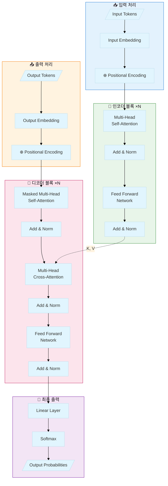

# Pipeline 1: Claude + Mermaid/Code 기반 파이프라인

## 개요
- **방식**: Claude가 Mermaid, TikZ, Python matplotlib 코드 생성 → 렌더링 도구로 시각화
- **장점**: 편집 가능, 버전 관리, 재현 가능, 무료
- **단점**: 렌더링 단계 필요, 복잡한 이미지는 한계

---

## 🔧 사용 방법

### Step 1: Claude에게 코드 요청

#### Mermaid 다이어그램 프롬프트
```
다음 구조를 Mermaid 다이어그램으로 만들어줘:
[원하는 구조 설명]

요구사항:
- 한글 레이블 사용
- 색상 구분으로 각 섹션 명확히
- subgraph로 논리적 그룹화
- 화살표에 데이터 흐름 표시
```

#### Python matplotlib 프롬프트
```
다음 모델 구조를 Python matplotlib/networkx로 시각화하는 코드를 만들어줘:
[원하는 구조 설명]

요구사항:
- 학술 논문에 적합한 스타일
- 300 DPI 이상 해상도
- 한글 폰트 지원 (맑은 고딕 또는 NanumGothic)
- 노드 색상으로 구분
```

---

## 📋 테스트 케이스 1: Transformer 구조

### Mermaid 코드 (Claude 생성용)


### Python 코드 (Claude 생성용)
```python
import matplotlib.pyplot as plt
import matplotlib.patches as mpatches
from matplotlib.patches import FancyBboxPatch, FancyArrowPatch
import numpy as np

# 한글 폰트 설정
plt.rcParams['font.family'] = 'AppleGothic'  # Mac
# plt.rcParams['font.family'] = 'Malgun Gothic'  # Windows
plt.rcParams['axes.unicode_minus'] = False

fig, ax = plt.subplots(1, 1, figsize=(14, 10), dpi=150)
ax.set_xlim(0, 14)
ax.set_ylim(0, 10)
ax.axis('off')

# 색상 정의
colors = {
    'input': '#e3f2fd',
    'encoder': '#e8f5e9',
    'output': '#fff3e0',
    'decoder': '#fce4ec',
    'final': '#f3e5f5'
}

def draw_box(ax, x, y, w, h, text, color, fontsize=9):
    box = FancyBboxPatch((x, y), w, h,
                         boxstyle="round,pad=0.05,rounding_size=0.2",
                         facecolor=color, edgecolor='black', linewidth=1.5)
    ax.add_patch(box)
    ax.text(x + w/2, y + h/2, text, ha='center', va='center',
            fontsize=fontsize, fontweight='bold', wrap=True)

def draw_arrow(ax, start, end, color='black'):
    ax.annotate('', xy=end, xytext=start,
                arrowprops=dict(arrowstyle='->', color=color, lw=1.5))

# 인코더 섹션
draw_box(ax, 1, 7, 2.5, 0.8, 'Input\nEmbedding', colors['input'])
draw_box(ax, 1, 5.5, 2.5, 0.8, 'Multi-Head\nSelf-Attention', colors['encoder'])
draw_box(ax, 1, 4, 2.5, 0.8, 'Add & Norm', colors['encoder'])
draw_box(ax, 1, 2.5, 2.5, 0.8, 'Feed Forward', colors['encoder'])
draw_box(ax, 1, 1, 2.5, 0.8, 'Add & Norm', colors['encoder'])

# 디코더 섹션
draw_box(ax, 5.5, 7, 2.5, 0.8, 'Output\nEmbedding', colors['output'])
draw_box(ax, 5.5, 5.5, 2.5, 0.8, 'Masked\nSelf-Attention', colors['decoder'])
draw_box(ax, 5.5, 4, 2.5, 0.8, 'Cross-Attention', colors['decoder'])
draw_box(ax, 5.5, 2.5, 2.5, 0.8, 'Feed Forward', colors['decoder'])
draw_box(ax, 5.5, 1, 2.5, 0.8, 'Add & Norm', colors['decoder'])

# 최종 출력
draw_box(ax, 10, 4, 2.5, 0.8, 'Linear', colors['final'])
draw_box(ax, 10, 2.5, 2.5, 0.8, 'Softmax', colors['final'])

# 화살표
draw_arrow(ax, (2.25, 7), (2.25, 6.3))
draw_arrow(ax, (2.25, 5.5), (2.25, 4.8))
draw_arrow(ax, (2.25, 4), (2.25, 3.3))
draw_arrow(ax, (2.25, 2.5), (2.25, 1.8))

# 제목
ax.text(7, 9.5, 'Transformer Architecture', fontsize=16, fontweight='bold', ha='center')

plt.tight_layout()
plt.savefig('transformer_matplotlib.png', dpi=300, bbox_inches='tight',
            facecolor='white', edgecolor='none')
plt.show()
```

---

## 📋 테스트 케이스 2: CNN 구조

### Mermaid 코드


---

## 🖥️ 렌더링 방법

### 1. Mermaid Live Editor (가장 쉬움)
- **URL**: https://mermaid.live/
- **사용법**: 코드 복사 → 붙여넣기 → PNG/SVG 다운로드

### 2. VS Code Extension
- **Extension**: "Markdown Preview Mermaid Support" 설치
- **사용법**: .md 파일에 mermaid 코드 블록 작성 → Preview

### 3. Python 렌더링
```bash
pip install mermaid-py
```
```python
import mermaid as md
from mermaid.graph import Graph

graph = Graph('Transformer', """
flowchart TB
    A[Input] --> B[Encoder]
    B --> C[Decoder]
    C --> D[Output]
""")

render = md.Mermaid(graph)
render.to_png('output.png')
```

### 4. 명령줄 도구
```bash
npm install -g @mermaid-js/mermaid-cli
mmdc -i diagram.mmd -o diagram.png -t dark -b transparent
```

---

## ✅ 평가 기준

| 항목 | 점수 (1-5) | 비고 |
|------|----------|------|
| 구조 정확성 | | 모델 구조 정확히 반영 |
| 시각적 명확성 | | 레이아웃, 색상, 가독성 |
| 텍스트 품질 | | 한글/영어 렌더링 |
| 편집 용이성 | | 코드 수정 후 재생성 |
| 논문 적합성 | | 학술 출판물 품질 |

**총점**: ___ / 25
