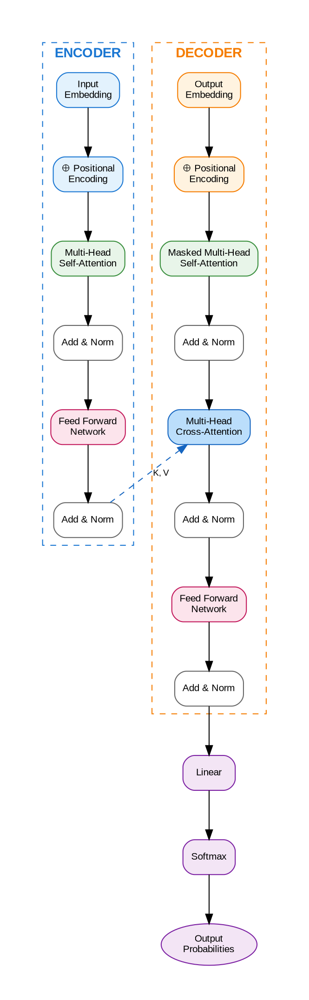

# Pipeline 3: Kimi K2 코드 생성 파이프라인

## 개요
- **방식**: Kimi K2의 강력한 코딩 능력으로 다이어그램 코드 생성 → 렌더링
- **장점**: 정밀한 코드 생성, 복잡한 로직 처리, 무료, 편집 가능
- **단점**: 렌더링 단계 필요, 직접 이미지 생성 불가

---

## 🧠 Kimi K2 특성

| 특성 | 상세 |
|------|------|
| **파라미터** | 1.04T (32B activated, MoE) |
| **강점** | 코딩, 에이전트 태스크, 복잡한 추론 |
| **약점** | 이미지 직접 생성 불가 |
| **접근** | https://kimi.moonshot.cn 또는 API |
| **비용** | 무료 티어 있음 |

---

## 🔧 사용 방법

### Step 1: Kimi K2에게 코드 요청

**접속**: https://kimi.moonshot.cn (또는 API)

**프롬프트 전략**: Kimi K2는 코딩에 특화되어 있으므로, 상세한 코드 생성 요청이 효과적

---

## 📋 테스트 케이스별 프롬프트 및 예상 코드

### 테스트 1: Transformer Architecture

**Kimi K2 프롬프트 (Python matplotlib)**:
```
Create a complete Python script using matplotlib and networkx to draw a professional Transformer architecture diagram.

Requirements:
1. Show Encoder (left) and Decoder (right) side by side
2. Encoder components: Input Embedding, Positional Encoding, Multi-Head Self-Attention, Add&Norm, Feed Forward, Add&Norm
3. Decoder components: Output Embedding, Positional Encoding, Masked Self-Attention, Add&Norm, Cross-Attention (with connection from Encoder), Add&Norm, Feed Forward, Add&Norm
4. Final layers: Linear, Softmax
5. Use professional colors: Blue theme for encoder, Orange theme for decoder
6. Include all arrows showing data flow
7. Add "K, V" label on the encoder-to-decoder cross-attention connection
8. White background, suitable for academic publication
9. Save as PNG with 300 DPI
10. Use a font that supports Korean (fallback to English is OK)

Output a complete, runnable Python script.
```

**예상 출력 (Kimi K2가 생성할 코드)**:
```python
import matplotlib.pyplot as plt
import matplotlib.patches as patches
from matplotlib.patches import FancyBboxPatch, FancyArrowPatch
import numpy as np

# Figure setup
fig, ax = plt.subplots(figsize=(16, 12), dpi=300)
ax.set_xlim(0, 16)
ax.set_ylim(0, 12)
ax.axis('off')
ax.set_facecolor('white')

# Color definitions
ENCODER_COLOR = '#e3f2fd'
ENCODER_BORDER = '#1976d2'
DECODER_COLOR = '#fff3e0'
DECODER_BORDER = '#f57c00'
ATTENTION_COLOR = '#e8f5e9'
FFN_COLOR = '#fce4ec'
FINAL_COLOR = '#f3e5f5'

def draw_component(ax, x, y, width, height, text, facecolor, edgecolor, fontsize=9):
    """Draw a rounded rectangle component with text."""
    box = FancyBboxPatch(
        (x - width/2, y - height/2), width, height,
        boxstyle="round,pad=0.02,rounding_size=0.1",
        facecolor=facecolor, edgecolor=edgecolor, linewidth=2
    )
    ax.add_patch(box)
    ax.text(x, y, text, ha='center', va='center', fontsize=fontsize,
            fontweight='bold', wrap=True)

def draw_arrow(ax, start, end, color='black', style='->', connectionstyle='arc3,rad=0'):
    """Draw an arrow between two points."""
    arrow = FancyArrowPatch(
        start, end,
        arrowstyle=style,
        connectionstyle=connectionstyle,
        color=color,
        linewidth=1.5,
        mutation_scale=15
    )
    ax.add_patch(arrow)

# ============ ENCODER SECTION (Left) ============
encoder_x = 4
encoder_start_y = 10

# Title
ax.text(encoder_x, 11.5, 'ENCODER', fontsize=14, fontweight='bold',
        ha='center', color=ENCODER_BORDER)

# Input Embedding
draw_component(ax, encoder_x, encoder_start_y, 2.5, 0.7,
               'Input\nEmbedding', ENCODER_COLOR, ENCODER_BORDER)

# Positional Encoding
draw_component(ax, encoder_x, encoder_start_y - 1.2, 2.5, 0.7,
               '⊕ Positional\nEncoding', ENCODER_COLOR, ENCODER_BORDER)

# Multi-Head Self-Attention
draw_component(ax, encoder_x, encoder_start_y - 2.6, 2.5, 0.8,
               'Multi-Head\nSelf-Attention', ATTENTION_COLOR, '#388e3c')

# Add & Norm 1
draw_component(ax, encoder_x, encoder_start_y - 3.8, 2.5, 0.5,
               'Add & Norm', '#ffffff', '#666666')

# Feed Forward
draw_component(ax, encoder_x, encoder_start_y - 4.8, 2.5, 0.7,
               'Feed Forward\nNetwork', FFN_COLOR, '#c2185b')

# Add & Norm 2
draw_component(ax, encoder_x, encoder_start_y - 5.8, 2.5, 0.5,
               'Add & Norm', '#ffffff', '#666666')

# Encoder block label
ax.text(encoder_x, encoder_start_y - 6.5, '× N', fontsize=12,
        ha='center', style='italic', color='#666666')

# Encoder arrows
positions_enc = [10, 8.8, 7.4, 6.2, 5.2, 4.2]
for i in range(len(positions_enc) - 1):
    draw_arrow(ax, (encoder_x, positions_enc[i] - 0.35),
               (encoder_x, positions_enc[i+1] + 0.35))

# ============ DECODER SECTION (Right) ============
decoder_x = 12
decoder_start_y = 10

# Title
ax.text(decoder_x, 11.5, 'DECODER', fontsize=14, fontweight='bold',
        ha='center', color=DECODER_BORDER)

# Output Embedding
draw_component(ax, decoder_x, decoder_start_y, 2.5, 0.7,
               'Output\nEmbedding', DECODER_COLOR, DECODER_BORDER)

# Positional Encoding
draw_component(ax, decoder_x, decoder_start_y - 1.2, 2.5, 0.7,
               '⊕ Positional\nEncoding', DECODER_COLOR, DECODER_BORDER)

# Masked Multi-Head Self-Attention
draw_component(ax, decoder_x, decoder_start_y - 2.6, 2.5, 0.8,
               'Masked Multi-Head\nSelf-Attention', ATTENTION_COLOR, '#388e3c')

# Add & Norm 1
draw_component(ax, decoder_x, decoder_start_y - 3.6, 2.5, 0.5,
               'Add & Norm', '#ffffff', '#666666')

# Cross-Attention
draw_component(ax, decoder_x, decoder_start_y - 4.6, 2.5, 0.8,
               'Multi-Head\nCross-Attention', '#bbdefb', '#1565c0')

# Add & Norm 2
draw_component(ax, decoder_x, decoder_start_y - 5.6, 2.5, 0.5,
               'Add & Norm', '#ffffff', '#666666')

# Feed Forward
draw_component(ax, decoder_x, decoder_start_y - 6.6, 2.5, 0.7,
               'Feed Forward\nNetwork', FFN_COLOR, '#c2185b')

# Add & Norm 3
draw_component(ax, decoder_x, decoder_start_y - 7.5, 2.5, 0.5,
               'Add & Norm', '#ffffff', '#666666')

# Decoder block label
ax.text(decoder_x, decoder_start_y - 8.2, '× N', fontsize=12,
        ha='center', style='italic', color='#666666')

# Decoder arrows
positions_dec = [10, 8.8, 7.4, 6.4, 5.4, 4.4, 3.4, 2.5]
for i in range(len(positions_dec) - 1):
    draw_arrow(ax, (decoder_x, positions_dec[i] - 0.35),
               (decoder_x, positions_dec[i+1] + 0.35))

# ============ CROSS-ATTENTION CONNECTION ============
# Arrow from Encoder to Decoder Cross-Attention
draw_arrow(ax, (encoder_x + 1.25, 4.2), (decoder_x - 1.25, 5.4),
           color='#1565c0', connectionstyle='arc3,rad=-0.2')
ax.text(8, 5.2, 'K, V', fontsize=10, fontweight='bold', color='#1565c0')

# ============ FINAL LAYERS ============
final_x = 12
final_y = 1.5

# Linear
draw_component(ax, final_x, final_y + 0.5, 2.5, 0.6,
               'Linear', FINAL_COLOR, '#7b1fa2')

# Softmax
draw_component(ax, final_x, final_y - 0.5, 2.5, 0.6,
               'Softmax', FINAL_COLOR, '#7b1fa2')

# Final arrows
draw_arrow(ax, (decoder_x, 2.5 - 0.25), (final_x, final_y + 0.8))
draw_arrow(ax, (final_x, final_y + 0.2), (final_x, final_y - 0.2))

# Output label
ax.text(final_x, final_y - 1.2, 'Output\nProbabilities', fontsize=10,
        ha='center', va='top', style='italic')

# ============ INPUT/OUTPUT LABELS ============
ax.text(encoder_x, 10.8, '↑ Inputs', fontsize=9, ha='center', color='#666666')
ax.text(decoder_x, 10.8, '↑ Outputs (shifted)', fontsize=9, ha='center', color='#666666')

# ============ TITLE ============
ax.text(8, 12, 'Transformer Architecture', fontsize=18, fontweight='bold', ha='center')

# Save figure
plt.tight_layout()
plt.savefig('transformer_architecture.png', dpi=300, bbox_inches='tight',
            facecolor='white', edgecolor='none')
plt.show()

print("Diagram saved as 'transformer_architecture.png'")
```

---

**Kimi K2 프롬프트 (Graphviz/DOT)**:
```
Create a Graphviz DOT file for Transformer architecture diagram.

Requirements:
1. Use subgraph for Encoder and Decoder
2. Show all components with proper styling
3. Include cross-attention connection from encoder to decoder
4. Use rankdir=TB for top-to-bottom flow
5. Professional colors suitable for academic papers
6. Output complete .dot file that can be rendered with Graphviz

Output the complete DOT code.
```

**예상 출력 (Graphviz DOT)**:


**렌더링 명령**:
```bash
dot -Tpng transformer.dot -o transformer_graphviz.png -Gdpi=300
```

---

**Kimi K2 프롬프트 (TikZ/LaTeX)**:
```
Create a complete TikZ code for Transformer architecture diagram that can be compiled with LaTeX.

Requirements:
1. Use tikzpicture environment
2. Define custom styles for encoder, decoder, attention blocks
3. Show all components of Transformer
4. Include cross-attention connection
5. Use professional colors
6. Output complete, compilable LaTeX document

Output complete LaTeX code with TikZ.
```

**예상 출력 (TikZ)**:
```latex
\documentclass[border=10pt]{standalone}
\usepackage{tikz}
\usetikzlibrary{shapes.geometric, arrows.meta, positioning, fit, backgrounds}

\begin{document}

\definecolor{encodercolor}{RGB}{227, 242, 253}
\definecolor{decodercolor}{RGB}{255, 243, 224}
\definecolor{attentioncolor}{RGB}{232, 245, 233}
\definecolor{ffncolor}{RGB}{252, 228, 236}
\definecolor{finalcolor}{RGB}{243, 229, 245}

\tikzstyle{block} = [rectangle, rounded corners, minimum width=2.5cm, minimum height=0.8cm,
                     text centered, draw=black, font=\small\bfseries]
\tikzstyle{encoder} = [block, fill=encodercolor, draw=blue!70]
\tikzstyle{decoder} = [block, fill=decodercolor, draw=orange!70]
\tikzstyle{attention} = [block, fill=attentioncolor, draw=green!50!black]
\tikzstyle{ffn} = [block, fill=ffncolor, draw=red!50!black]
\tikzstyle{final} = [block, fill=finalcolor, draw=purple!70]
\tikzstyle{norm} = [block, fill=white, draw=gray, minimum height=0.5cm]
\tikzstyle{arrow} = [thick, -Stealth]

\begin{tikzpicture}[node distance=0.8cm]

% Title
\node[font=\Large\bfseries] at (3.5, 1) {Transformer Architecture};

% Encoder
\node[encoder] (enc_input) at (0, 0) {Input Embedding};
\node[encoder, below=of enc_input] (enc_pos) {+ Positional Encoding};
\node[attention, below=of enc_pos] (enc_attn) {Multi-Head\\Self-Attention};
\node[norm, below=of enc_attn] (enc_norm1) {Add \& Norm};
\node[ffn, below=of enc_norm1] (enc_ff) {Feed Forward};
\node[norm, below=of enc_ff] (enc_norm2) {Add \& Norm};

% Encoder label
\node[above=0.3cm of enc_input, font=\bfseries, blue!70] {ENCODER};
\node[below=0.2cm of enc_norm2, font=\itshape, gray] {$\times N$};

% Decoder
\node[decoder] (dec_input) at (7, 0) {Output Embedding};
\node[decoder, below=of dec_input] (dec_pos) {+ Positional Encoding};
\node[attention, below=of dec_pos] (dec_masked) {Masked Multi-Head\\Self-Attention};
\node[norm, below=of dec_masked] (dec_norm1) {Add \& Norm};
\node[attention, below=of dec_norm1, fill=blue!20] (dec_cross) {Multi-Head\\Cross-Attention};
\node[norm, below=of dec_cross] (dec_norm2) {Add \& Norm};
\node[ffn, below=of dec_norm2] (dec_ff) {Feed Forward};
\node[norm, below=of dec_ff] (dec_norm3) {Add \& Norm};

% Decoder label
\node[above=0.3cm of dec_input, font=\bfseries, orange!70] {DECODER};
\node[below=0.2cm of dec_norm3, font=\itshape, gray] {$\times N$};

% Final layers
\node[final, below=1cm of dec_norm3] (linear) {Linear};
\node[final, below=of linear] (softmax) {Softmax};

% Arrows - Encoder
\draw[arrow] (enc_input) -- (enc_pos);
\draw[arrow] (enc_pos) -- (enc_attn);
\draw[arrow] (enc_attn) -- (enc_norm1);
\draw[arrow] (enc_norm1) -- (enc_ff);
\draw[arrow] (enc_ff) -- (enc_norm2);

% Arrows - Decoder
\draw[arrow] (dec_input) -- (dec_pos);
\draw[arrow] (dec_pos) -- (dec_masked);
\draw[arrow] (dec_masked) -- (dec_norm1);
\draw[arrow] (dec_norm1) -- (dec_cross);
\draw[arrow] (dec_cross) -- (dec_norm2);
\draw[arrow] (dec_norm2) -- (dec_ff);
\draw[arrow] (dec_ff) -- (dec_norm3);
\draw[arrow] (dec_norm3) -- (linear);
\draw[arrow] (linear) -- (softmax);

% Cross-attention connection
\draw[arrow, blue!70, dashed] (enc_norm2.east) -- ++(0.5, 0) |- node[above, pos=0.75] {\small K, V} (dec_cross.west);

\end{tikzpicture}

\end{document}
```

**렌더링 명령**:
```bash
pdflatex transformer.tex
convert -density 300 transformer.pdf transformer_tikz.png
```

---

## 🖥️ 렌더링 방법 요약

### Python matplotlib
```bash
# 환경 설정
pip install matplotlib numpy networkx

# 실행
python transformer_diagram.py
```

### Graphviz
```bash
# 설치 (Mac)
brew install graphviz

# 설치 (Ubuntu)
sudo apt-get install graphviz

# 렌더링
dot -Tpng diagram.dot -o output.png -Gdpi=300
dot -Tsvg diagram.dot -o output.svg
```

### TikZ/LaTeX
```bash
# 설치 (Mac)
brew install --cask mactex

# 렌더링
pdflatex diagram.tex
# PDF → PNG 변환
convert -density 300 diagram.pdf diagram.png
```

### Mermaid (Kimi K2도 생성 가능)
```bash
npm install -g @mermaid-js/mermaid-cli
mmdc -i diagram.mmd -o output.png -t default -b white
```

---

## 📊 Kimi K2 vs Claude 비교

| 항목 | Kimi K2 | Claude |
|------|---------|--------|
| 코드 정확성 | ⭐⭐⭐⭐⭐ | ⭐⭐⭐⭐ |
| 복잡한 로직 | ⭐⭐⭐⭐⭐ | ⭐⭐⭐⭐ |
| 다양한 포맷 | ⭐⭐⭐⭐⭐ | ⭐⭐⭐⭐ |
| 한글 처리 | ⭐⭐⭐ | ⭐⭐⭐⭐ |
| 무료 접근 | ⭐⭐⭐⭐⭐ | ⭐⭐⭐ |
| 속도 | ⭐⭐⭐⭐ | ⭐⭐⭐⭐ |

---

## ✅ 평가 기준

| 항목 | 점수 (1-5) | 비고 |
|------|----------|------|
| 코드 정확성 | | 실행 오류 없이 동작 |
| 구조 반영 | | 요청한 모델 구조 정확히 구현 |
| 코드 품질 | | 가독성, 모듈화, 주석 |
| 렌더링 품질 | | 최종 이미지 품질 |
| 편집 용이성 | | 수정 및 커스터마이즈 |
| 재사용성 | | 다른 다이어그램에 적용 가능 |

**총점**: ___ / 30
